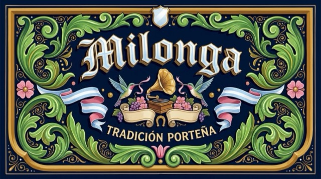

# Style Catalog — Full Details

Complete descriptions and all file links for each of the 159 styles. For a visual gallery, see the [main README](../README.md#all-styles).

[← Back to README](../README.md)

### Filete Porteño

Buenos Aires fileteado porteño translated into poster, sign and label systems: a symmetrical, fully framed panel of glossy hand-painted enamel ornament built from acanthus leaves with volutes, a modeled band, flat flowers, two-tone ribbons and filigree, with gothic fish-tail lettering that carries a projected body, cast shadow and white highlight strokes. Backgrounds are usually white or dark navy blue.

Files: [style.json](../styles/filete-porteno/style.json) · [Copy Prompt](copy-prompts/filete-porteno.md) · [16:9 preview](../styles/filete-porteno/preview-16x9.jpg) · [9:16 preview](../styles/filete-porteno/preview-9x16.jpg)

---

### Velocity Type Sport

Extreme near-to-far sports photography interlocked with giant white oblique type, a dark vignetted gradient lit by a bright colored haze, and close-up gear or contact points that express each sport's force and direction.

Files: [style.json](../styles/velocity-type-sport/style.json) · [Copy Prompt](copy-prompts/velocity-type-sport.md) · [16:9 preview](../styles/velocity-type-sport/preview-16x9.jpg) · [9:16 preview](../styles/velocity-type-sport/preview-9x16.jpg) · [Folder](../styles/velocity-type-sport)

---

### Velocity Type Sport — Part 2

Continues Velocity Type Sport's near-to-far athletic photography, giant white oblique lettering, dark fields with a single-color light haze and selective motion blur, now with basketball, snowboarding, kayaking and boxing.

Files: [style.json](../styles/velocity-type-sport-part-02/style.json) · [Copy Prompt](copy-prompts/velocity-type-sport-part-02.md) · [16:9 preview](../styles/velocity-type-sport-part-02/preview-16x9.jpg) · [9:16 preview](../styles/velocity-type-sport-part-02/preview-9x16.jpg) · [Folder](../styles/velocity-type-sport-part-02)

---

### Velocity Type Sport — Part 3

Continues the near-to-far sports photography, giant white oblique type, near-black backgrounds and single-color haze, switching to tennis, still rings, speed skating and archery to show four force structures: net, ring, blade and bowstring.

Files: [style.json](../styles/velocity-type-sport-part-03/style.json) · [Copy Prompt](copy-prompts/velocity-type-sport-part-03.md) · [16:9 preview](../styles/velocity-type-sport-part-03/preview-16x9.jpg) · [9:16 preview](../styles/velocity-type-sport-part-03/preview-9x16.jpg) · [Folder](../styles/velocity-type-sport-part-03)

---

### Velocity Type Sport — Part 4

Continues the strong-perspective sports photography, giant white oblique type, near-black field and single-color haze, using a baseball swing, a barbell lift, barrel-wave surfing and a rhythmic-gymnastics ribbon to show four spatial structures: cylinder, heavy plates, wave tube and flexible curve.

Files: [style.json](../styles/velocity-type-sport-part-04/style.json) · [Copy Prompt](copy-prompts/velocity-type-sport-part-04.md) · [16:9 preview](../styles/velocity-type-sport-part-04/preview-16x9.jpg) · [9:16 preview](../styles/velocity-type-sport-part-04/preview-9x16.jpg) · [Folder](../styles/velocity-type-sport-part-04)

---

### Acid Jolt Portrait Collage

A punchy portrait-poster system mixing warm, low-fi close-up photography, blunt photo-fragment inserts, massive lemon-yellow rounded lettering, and loose marker signals against dark, quiet fields.

Files: [style.json](../styles/acid-jolt-photo-collage/style.json) · [Copy Prompt](copy-prompts/acid-jolt-photo-collage.md) · [16:9 preview](../styles/acid-jolt-photo-collage/preview-16x9.jpg) · [9:16 preview](../styles/acid-jolt-photo-collage/preview-9x16.jpg) · [Folder](../styles/acid-jolt-photo-collage)

---

### Amber Orbit Editorial

Intimate warm macro photography, grazing amber light, ivory serif typography and fine overlapping orbital lines turn tactile details into quiet editorial stories about attention, making and time.

Files: [style.json](../styles/amber-orbit-editorial/style.json) · [Copy Prompt](copy-prompts/amber-orbit-editorial.md) · [16:9 preview](../styles/amber-orbit-editorial/preview-16x9.jpg) · [9:16 preview](../styles/amber-orbit-editorial/preview-9x16.jpg) · [Folder](../styles/amber-orbit-editorial)

---

### Felt Motion Brand Campaign

An intimate sports photograph captures one bodily state through moody warm light, deep natural shadow and pronounced selective focus. A prominent white original logo and tight two-line wordmark overlap the optical center of the photograph.

Files: [style.json](../styles/felt-motion-brand-campaign/style.json) · [Copy Prompt](copy-prompts/felt-motion-brand-campaign.md) · [16:9 preview](../styles/felt-motion-brand-campaign/preview-16x9.jpg) · [9:16 preview](../styles/felt-motion-brand-campaign/preview-9x16.jpg) · [Folder](../styles/felt-motion-brand-campaign)

---

### Felt Motion Brand Campaign — Set 02

An intimate sports photograph captures one bodily state through moody warm light, deep natural shadow and pronounced selective focus. A prominent white original logo and tight two-line wordmark overlap the optical center of the photograph.

Files: [style.json](../styles/felt-motion-brand-campaign-set-02/style.json) · [Copy Prompt](copy-prompts/felt-motion-brand-campaign-set-02.md) · [16:9 preview](../styles/felt-motion-brand-campaign-set-02/preview-16x9.jpg) · [9:16 preview](../styles/felt-motion-brand-campaign-set-02/preview-9x16.jpg) · [Folder](../styles/felt-motion-brand-campaign-set-02)

---

### Monumental Editorial — Set 02

A cross-domain extension of monumental sports editorial typography: clean giant condensed white lettering collides with tactile botanical, musical, food, and chrome-product photography, each in a distinct palette and spatial arrangement.

Files: [style.json](../styles/monumental-editorial-set-02/style.json) · [Copy Prompt](copy-prompts/monumental-editorial-set-02.md) · [16:9 preview](../styles/monumental-editorial-set-02/preview-16x9.jpg) · [9:16 preview](../styles/monumental-editorial-set-02/preview-9x16.jpg) · [Folder](../styles/monumental-editorial-set-02)

---

### Monumental Sport Editorial

A premium campaign-poster system built from lifelike athletic photography, monumental condensed white typography, warm stone neutrals, deep black shapes, and precise image-type collisions.

Files: [style.json](../styles/monumental-sport-editorial/style.json) · [Copy Prompt](copy-prompts/monumental-sport-editorial.md) · [16:9 preview](../styles/monumental-sport-editorial/preview-16x9.jpg) · [9:16 preview](../styles/monumental-sport-editorial/preview-9x16.jpg) · [Folder](../styles/monumental-sport-editorial)

---

### Slice Signal Editorial

Restrained, sharp experimental editorial posters built from oversized condensed headlines, black-white-and-scarlet blocks, and photographic subjects interrupted by vertical slices.

Files: [style.json](../styles/slice-signal-editorial/style.json) · [Copy Prompt](copy-prompts/slice-signal-editorial.md) · [16:9 preview](../styles/slice-signal-editorial/preview-16x9.jpg) · [9:16 preview](../styles/slice-signal-editorial/preview-9x16.jpg) · [Folder](../styles/slice-signal-editorial)

---

### Chromatic Impact Athlete

High-contrast athletic editorial posters that turn a frozen movement into a collision of grayscale body photography, extreme perspective, and a single red-orange energy accent.

Files: [style.json](../styles/chromatic-impact-athlete/style.json) · [Copy Prompt](copy-prompts/chromatic-impact-athlete.md) · [16:9 preview](../styles/chromatic-impact-athlete/preview-16x9.jpg) · [9:16 preview](../styles/chromatic-impact-athlete/preview-9x16.jpg) · [Folder](../styles/chromatic-impact-athlete)

---

### Cream Curve Editorial

Sunlit photographic editorial posters shaped by monumental condensed cream lettering, elastic curves and deliberate subject/type depth exchanges. Each theme gives the lettering a different spatial job.

Files: [style.json](../styles/cream-curve-editorial/style.json) · [Copy Prompt](copy-prompts/cream-curve-editorial.md) · [16:9 preview](../styles/cream-curve-editorial/preview-16x9.jpg) · [9:16 preview](../styles/cream-curve-editorial/preview-9x16.jpg) · [Folder](../styles/cream-curve-editorial)

---

### Kinetic Footwear Process

A premium, motion-led footwear campaign turns athletic movement into a compact visual process story: a newly invented shoe mechanism is shown through action, sequential states and tactile engineering close-ups, with restrained micro-labels.

Files: [style.json](../styles/kinetic-footwear-process/style.json) · [Copy Prompt](copy-prompts/kinetic-footwear-process.md) · [16:9 preview](../styles/kinetic-footwear-process/preview-16x9.jpg) · [9:16 preview](../styles/kinetic-footwear-process/preview-9x16.jpg) · [Folder](../styles/kinetic-footwear-process)

---

### Sensory Footwear Lab

Minimal future-sport product concepts pair tactile podded outsoles with quiet athletic gestures, modular editorial panels, ice-cool architecture and signal-coral accents.

Files: [style.json](../styles/sensory-footwear-lab/style.json) · [Copy Prompt](copy-prompts/sensory-footwear-lab.md) · [16:9 preview](../styles/sensory-footwear-lab/preview-16x9.jpg) · [9:16 preview](../styles/sensory-footwear-lab/preview-9x16.jpg) · [Folder](../styles/sensory-footwear-lab)

---

### Visual OS 051 — Freeze the Gear

Full-bleed future-sport posters isolate one razor-sharp piece of gear against directional motion trails, luminous gradients and a single giant white geometric slogan.

Files: [style.json](../styles/vector-atelier/style.json) · [Copy Prompt](copy-prompts/vector-atelier.md) · [16:9 preview](../styles/vector-atelier/preview-16x9.jpg) · [9:16 preview](../styles/vector-atelier/preview-9x16.jpg) · [Folder](../styles/vector-atelier)

---

### Vector Process Study

Premium footwear process boards explain load, flex, fit and construction through sequential image panels, tactile material macros, sparse micro-labels and a distinct sculptural shoe architecture.

Files: [style.json](../styles/vector-process-study/style.json) · [Copy Prompt](copy-prompts/vector-process-study.md) · [16:9 preview](../styles/vector-process-study/preview-16x9.jpg) · [9:16 preview](../styles/vector-process-study/preview-9x16.jpg) · [Folder](../styles/vector-process-study)

---

### Annotated Absence

A photographic subject yields to white paper, retained as hand-traced contour, intimate word labels and sparse gray image fragments.

Files: [style.json](../styles/annotated-absence/style.json) · [Copy Prompt](copy-prompts/annotated-absence.md) · [16:9 preview](../styles/annotated-absence/preview-16x9.jpg) · [9:16 preview](../styles/annotated-absence/preview-9x16.jpg) · [Folder](../styles/annotated-absence)

---

### Ink Body Manifesto

Realistic figures on pale gray-white ground, their torsos constructed from irregular black handwriting, with a compact heavy black headline and sparse red handwritten marks.

Files: [style.json](../styles/ink-body-manifesto/style.json) · [Copy Prompt](copy-prompts/ink-body-manifesto.md) · [16:9 preview](../styles/ink-body-manifesto/preview-16x9.jpg) · [9:16 preview](../styles/ink-body-manifesto/preview-9x16.jpg) · [Folder](../styles/ink-body-manifesto)

---

### Memory Fragment Portrait

A coarse-halftone black-and-white portrait tiled by a regular white grid; selected cells become faded life photographs, blank paper, and one fluorescent-pink key memory. From afar it is a face; up close it is a relationship.

Files: [style.json](../styles/memory-fragment-portrait/style.json) · [Copy Prompt](copy-prompts/memory-fragment-portrait.md) · [16:9 preview](../styles/memory-fragment-portrait/preview-16x9.jpg) · [9:16 preview](../styles/memory-fragment-portrait/preview-9x16.jpg) · [Folder](../styles/memory-fragment-portrait)

---

### Portrait as Terrain

Monochrome human fragments become monumental single-color landscapes inhabited by tiny figures.

Files: [style.json](../styles/portrait-as-terrain/style.json) · [Copy Prompt](copy-prompts/portrait-as-terrain.md) · [16:9 preview](../styles/portrait-as-terrain/preview-16x9.jpg) · [9:16 preview](../styles/portrait-as-terrain/preview-9x16.jpg) · [Folder](../styles/portrait-as-terrain)

---

### Acid Burst Motion Type

Extreme wide-angle action photography with an enlarged near-lens object, saturated blue environmental depth, one acid-colored angular burst behind the subject and oversized lean typography sweeping diagonally through the foreground.

Files: [style.json](../styles/acid-burst-motion-type/style.json) · [Copy Prompt](copy-prompts/acid-burst-motion-type.md) · [16:9 preview](../styles/acid-burst-motion-type/preview-16x9.jpg) · [9:16 preview](../styles/acid-burst-motion-type/preview-9x16.jpg) · [Folder](../styles/acid-burst-motion-type)

---

### Cream Megatype Impact Editorial

Close wide-angle action photographs interlocked with enormous warm-cream condensed background type, cobalt environmental depth, tactile ground or water, and a compact rule-divided editorial information rail.

Files: [style.json](../styles/cream-megatype-impact-editorial/style.json) · [Copy Prompt](copy-prompts/cream-megatype-impact-editorial.md) · [16:9 preview](../styles/cream-megatype-impact-editorial/preview-16x9.jpg) · [9:16 preview](../styles/cream-megatype-impact-editorial/preview-9x16.jpg) · [Folder](../styles/cream-megatype-impact-editorial)

---

### Duotone Step Window Editorial

Oversized regular-weight grotesk typography, emphatic event numerals and a continuous grainy action photograph selectively re-inked through hard-edged stepped color windows.

Files: [style.json](../styles/duotone-step-window-editorial/style.json) · [Copy Prompt](copy-prompts/duotone-step-window-editorial.md) · [16:9 preview](../styles/duotone-step-window-editorial/preview-16x9.jpg) · [9:16 preview](../styles/duotone-step-window-editorial/preview-9x16.jpg) · [Folder](../styles/duotone-step-window-editorial)

---

### Halftone Chroma Fragment Editorial

High-contrast editorial collage in which monumental coarse black-and-white photographic halftones interact with selective crisp color fragments, heavy display typography and sparse handwritten interventions.

Files: [style.json](../styles/halftone-chroma-fragment-editorial/style.json) · [Copy Prompt](copy-prompts/halftone-chroma-fragment-editorial.md) · [16:9 preview](../styles/halftone-chroma-fragment-editorial/preview-16x9.jpg) · [9:16 preview](../styles/halftone-chroma-fragment-editorial/preview-9x16.jpg) · [Folder](../styles/halftone-chroma-fragment-editorial)

---

### Neon Strip Low Angle Campaign

Product-led oblique photography, muted grey environments and precise highlighter editorial typography; each product generates a distinct composition.

Files: [style.json](../styles/neon-strip-low-angle-campaign/style.json) · [Copy Prompt](copy-prompts/neon-strip-low-angle-campaign.md) · [16:9 preview](../styles/neon-strip-low-angle-campaign/preview-16x9.jpg) · [9:16 preview](../styles/neon-strip-low-angle-campaign/preview-9x16.jpg) · [Folder](../styles/neon-strip-low-angle-campaign)

---

### Op Stripe Card Editorial

Playing-card editorial language meets optical black ink ribbons, monumental high-contrast serif type and a crisp colored photographic person on subtly textured light paper.

Files: [style.json](../styles/op-stripe-card-editorial/style.json) · [Copy Prompt](copy-prompts/op-stripe-card-editorial.md) · [16:9 preview](../styles/op-stripe-card-editorial/preview-16x9.jpg) · [9:16 preview](../styles/op-stripe-card-editorial/preview-9x16.jpg) · [Folder](../styles/op-stripe-card-editorial)

---

### Skyward Condensed Action

Worm-eye airborne sports photography against expansive cool blue sky, with monumental ultra-condensed fluorescent uppercase type occluded by a sharply foreshortened human silhouette.

Files: [style.json](../styles/skyward-condensed-action/style.json) · [Copy Prompt](copy-prompts/skyward-condensed-action.md) · [16:9 preview](../styles/skyward-condensed-action/preview-16x9.jpg) · [9:16 preview](../styles/skyward-condensed-action/preview-9x16.jpg) · [Folder](../styles/skyward-condensed-action)

---

### Color Pop Interlocked Marker Type

Dense playful hand-drawn megatype: irregular interlocking colored letters, bold black contours, sparse doodles and neutral paper.

Files: [style.json](../styles/color-pop-interlocked-marker-type/style.json) · [Copy Prompt](copy-prompts/color-pop-interlocked-marker-type.md) · [16:9 preview](../styles/color-pop-interlocked-marker-type/preview-16x9.jpg) · [9:16 preview](../styles/color-pop-interlocked-marker-type/preview-9x16.jpg) · [Folder](../styles/color-pop-interlocked-marker-type)

---

### Grainy Envelope Flyer Collage

A tactile event poster built around repeated photocopied flyers emerging from a saturated paper envelope, framed by cutout icons and spare black type.

Files: [style.json](../styles/grainy-envelope-flyer-collage/style.json) · [Copy Prompt](copy-prompts/grainy-envelope-flyer-collage.md) · [16:9 preview](../styles/grainy-envelope-flyer-collage/preview-16x9.jpg) · [9:16 preview](../styles/grainy-envelope-flyer-collage/preview-9x16.jpg) · [Folder](../styles/grainy-envelope-flyer-collage)

---

### Monochrome Tech-Grid Editorial

A severe black-and-white editorial poster system that combines an oversized compressed headline, a dense modular field of technical micro-information, and one documentary photograph cropped with monumental scale. Off-white paper, distressed ink, thin rules, registration motifs, and a restrained safety-red accent make the layout feel like an experimental identity manual crossed with an archival industrial contact sheet.

Files: [style.json](../styles/monochrome-tech-grid-editorial/style.json) · [Copy Prompt](copy-prompts/monochrome-tech-grid-editorial.md) · [16:9 preview](../styles/monochrome-tech-grid-editorial/preview-16x9.jpg) · [9:16 preview](../styles/monochrome-tech-grid-editorial/preview-9x16.jpg) · [Folder](../styles/monochrome-tech-grid-editorial)

---

### Sculptural Type Helix — Refined

Refinement of the existing four helix portraits: retain subjects, props, palette and material families; improve close camera impact, letter hierarchy and scene integration without introducing new concepts.

Files: [style.json](../styles/tangerine-type-helix-fisheye/style.json) · [Copy Prompt](copy-prompts/tangerine-type-helix-fisheye.md) · [16:9 preview](../styles/tangerine-type-helix-fisheye/preview-16x9.jpg) · [9:16 preview](../styles/tangerine-type-helix-fisheye/preview-9x16.jpg) · [Folder](../styles/tangerine-type-helix-fisheye)

---

### Motorsport Technical Editorial

A high-energy motorsport editorial visual system that combines a dramatic original racing photograph with oversized condensed typography, industrial information cards, signal-yellow accents, and disciplined technical-document graphic grammar.

Files: [style.json](../styles/motorsport-technical-editorial/style.json) · [Copy Prompt](copy-prompts/motorsport-technical-editorial.md) · [16:9 preview](../styles/motorsport-technical-editorial/preview-16x9.jpg) · [9:16 preview](../styles/motorsport-technical-editorial/preview-9x16.jpg) · [Folder](../styles/motorsport-technical-editorial)

---

### Split Ink Monumental Editorial

A high-contrast editorial-collage system built from a strict warm-cream and vermilion split field, enormous cropped black letter architecture, a central monochrome full-body subject, and tactile foreground forms. A crumpled red material and an angular dark backdrop provide diagonal drama while microtype, dot grids, and distressed ink create a dense screenprinted poster surface.

Files: [style.json](../styles/split-ink-monumental-editorial/style.json) · [Copy Prompt](copy-prompts/split-ink-monumental-editorial.md) · [16:9 preview](../styles/split-ink-monumental-editorial/preview-16x9.jpg) · [9:16 preview](../styles/split-ink-monumental-editorial/preview-9x16.jpg) · [Folder](../styles/split-ink-monumental-editorial)

---

### Crimson Vanishing Point Editorial

A high-pressure editorial-poster system that turns a monochrome, ultra-wide one-point-perspective public interior into a typographic corridor. A lone central figure moves away from the viewer as enormous scarlet letters become receding floor, wall, and ceiling planes, while blurred peripheral bodies and faint technical text create urgency without clutter.

Files: [style.json](../styles/crimson-vanishing-point-editorial/style.json) · [Copy Prompt](copy-prompts/crimson-vanishing-point-editorial.md) · [16:9 preview](../styles/crimson-vanishing-point-editorial/preview-16x9.jpg) · [9:16 preview](../styles/crimson-vanishing-point-editorial/preview-9x16.jpg) · [Folder](../styles/crimson-vanishing-point-editorial)

---

### Retro Pop Sticker Cutout

A loud retro-pop scrapbook poster system that layers an oversized yellow display headline, red offset print shadows, a central natural-color portrait cutout with a thick irregular white die-cut border, cobalt-blue paper texture, and small playful sticker marks. The result feels handmade, glossy-magazine inspired, and high-energy without copying any character, celebrity, or source design.

Files: [style.json](../styles/retro-pop-sticker-cutout/style.json) · [Copy Prompt](copy-prompts/retro-pop-sticker-cutout.md) · [16:9 preview](../styles/retro-pop-sticker-cutout/preview-16x9.jpg) · [9:16 preview](../styles/retro-pop-sticker-cutout/preview-9x16.jpg) · [Folder](../styles/retro-pop-sticker-cutout)

---

### Red Monochrome Editorial Grid

A confrontational editorial-poster system built from monumental condensed typography, red-and-black duotone photography, rigid off-white gutters, and paper-like ink grain. The design treats photographic crops and type blocks as equal grid modules rather than placing a single hero image behind type.

Files: [style.json](../styles/red-monochrome-editorial-grid/style.json) · [Copy Prompt](copy-prompts/red-monochrome-editorial-grid.md) · [16:9 preview](../styles/red-monochrome-editorial-grid/preview-16x9.jpg) · [9:16 preview](../styles/red-monochrome-editorial-grid/preview-9x16.jpg) · [Folder](../styles/red-monochrome-editorial-grid)

---

### Split Scorched Editorial Poster

A high-contrast editorial campaign-poster system built from three interacting depth planes: a shadowed atmosphere, a monumental cropped hero, and one oversized foreground object that breaks the dark-versus-paper seam. The visual tension comes from that object intruding into the otherwise quiet warm-paper information field.

Files: [style.json](../styles/split-scorched-editorial-poster/style.json) · [Copy Prompt](copy-prompts/split-scorched-editorial-poster.md) · [16:9 preview](../styles/split-scorched-editorial-poster/preview-16x9.jpg) · [9:16 preview](../styles/split-scorched-editorial-poster/preview-9x16.jpg) · [Folder](../styles/split-scorched-editorial-poster)

---

### Neon Scribble Editorial Poster

A confrontational editorial poster system built from monumental ultra-condensed red typography, one centrally cropped black-and-white halftone portrait, offset rectangular photo fragments, and spontaneous electric-blue and acid-green marker annotations on warm cream paper.

Files: [style.json](../styles/neon-scribble-editorial-poster/style.json) · [Copy Prompt](copy-prompts/neon-scribble-editorial-poster.md) · [16:9 preview](../styles/neon-scribble-editorial-poster/preview-16x9.jpg) · [9:16 preview](../styles/neon-scribble-editorial-poster/preview-9x16.jpg) · [Folder](../styles/neon-scribble-editorial-poster)

---

### Vermilion Folk Screenprint Character Poster

A hand-pulled theatrical poster system built around one monumental front-facing character, a warm uncoated paper field, a tightly limited vermilion-to-rose ink family, carved folk-pattern fills, and hand-lettered display type that behaves as part of the illustration.

Files: [style.json](../styles/vermilion-folk-screenprint-character-poster/style.json) · [Copy Prompt](copy-prompts/vermilion-folk-screenprint-character-poster.md) · [16:9 preview](../styles/vermilion-folk-screenprint-character-poster/preview-16x9.jpg) · [9:16 preview](../styles/vermilion-folk-screenprint-character-poster/preview-9x16.jpg) · [Folder](../styles/vermilion-folk-screenprint-character-poster)

---

### Primary Block Isometric Editorial Poster Style

A crisp editorial poster system built from a sparse diagonal cluster of oversized rounded cuboids, oblique isometric depth, black hairline construction, bright primary-color top planes, darker side faces, oversized grotesk labels, and tiny Swiss-style perimeter copy on warm white paper.

Files: [style.json](../styles/primary-block-isometric-editorial-poster-style/style.json) · [Copy Prompt](copy-prompts/primary-block-isometric-editorial-poster-style.md) · [16:9 preview](../styles/primary-block-isometric-editorial-poster-style/preview-16x9.jpg) · [9:16 preview](../styles/primary-block-isometric-editorial-poster-style/preview-9x16.jpg) · [Folder](../styles/primary-block-isometric-editorial-poster-style)

---

### Signal Red Contour Poster

A severe two-ink public-information poster system built from a near-black field, one monumental flat silhouette defined by an agitated signal-red contour, and detached white grotesk text arranged around the perimeter like urgent fragments.

Files: [style.json](../styles/signal-red-contour-poster/style.json) · [Copy Prompt](copy-prompts/signal-red-contour-poster.md) · [16:9 preview](../styles/signal-red-contour-poster/preview-16x9.jpg) · [9:16 preview](../styles/signal-red-contour-poster/preview-9x16.jpg) · [Folder](../styles/signal-red-contour-poster)

---

### Electric Yellow Cutout Megatype Poster Style

A high-impact pop advertising poster system that places one oversized photoreal cutout subject over monumental warped display lettering, using an electric-yellow field, black upper type, cobalt-blue lower type, severe cropping, and tiny editorial metadata for scale contrast.

Files: [style.json](../styles/electric-yellow-cutout-megatype-poster-style/style.json) · [Copy Prompt](copy-prompts/electric-yellow-cutout-megatype-poster-style.md) · [16:9 preview](../styles/electric-yellow-cutout-megatype-poster-style/preview-16x9.jpg) · [9:16 preview](../styles/electric-yellow-cutout-megatype-poster-style/preview-9x16.jpg) · [Folder](../styles/electric-yellow-cutout-megatype-poster-style)

---

### Burnt Orange Halftone Hero Collage

A dense celebratory editorial poster system that combines one warm, flash-lit photographic hero cutout with burnt-orange screenprint panels, monumental condensed headline type, coarse halftone diagrams, dry-brush lettering, a looping foreground flourish, a monochrome base strip, and disciplined magazine microtype on aged cream paper.

Files: [style.json](../styles/burnt-orange-halftone-hero-collage/style.json) · [Copy Prompt](copy-prompts/burnt-orange-halftone-hero-collage.md) · [16:9 preview](../styles/burnt-orange-halftone-hero-collage/preview-16x9.jpg) · [9:16 preview](../styles/burnt-orange-halftone-hero-collage/preview-9x16.jpg) · [Folder](../styles/burnt-orange-halftone-hero-collage)

---

### Signal Red Petal Profile Editorial Cover

A maximal independent-magazine cover system built from a fragmented signal-red masthead, one monumental flat-color side-profile portrait, a sparse off-white editorial rail, and a huge right-heavy mantle of overlapping cobalt, coral, and hot-pink petal lobes. Multiple typographic voices, a single black burst, tiny drawn ephemera, and restrained uncoated-paper texture create a cheeky fashion-editorial rhythm without copying any real publication or person.

Files: [style.json](../styles/signal-red-petal-profile-editorial-cover/style.json) · [Copy Prompt](copy-prompts/signal-red-petal-profile-editorial-cover.md) · [16:9 preview](../styles/signal-red-petal-profile-editorial-cover/preview-16x9.jpg) · [9:16 preview](../styles/signal-red-petal-profile-editorial-cover/preview-9x16.jpg) · [Folder](../styles/signal-red-petal-profile-editorial-cover)

---

### Cobalt Pop Cutout Editorial

A high-saturation editorial poster system that combines one low-angle full-body photographic cutout with oversized irregular orange display lettering, a cobalt-to-sky-blue field, flat green organic edge shapes, and tiny cream callouts. The look is playful, spacious, and street-culture adjacent without becoming grungy or collage-dense.

Files: [style.json](../styles/cobalt-pop-cutout-editorial/style.json) · [Copy Prompt](copy-prompts/cobalt-pop-cutout-editorial.md) · [16:9 preview](../styles/cobalt-pop-cutout-editorial/preview-16x9.jpg) · [9:16 preview](../styles/cobalt-pop-cutout-editorial/preview-9x16.jpg) · [Folder](../styles/cobalt-pop-cutout-editorial)

---

### Crimson Noir Newsprint Editorial

A prestige culture-magazine cover system built from one monumental grayscale portrait, narrow Didone display type, condensed editorial callouts, selective deep-crimson documentary fragments, and a visibly fibrous newsprint finish.

Files: [style.json](../styles/crimson-noir-newsprint-editorial-style/style.json) · [Copy Prompt](copy-prompts/crimson-noir-newsprint-editorial-style.md) · [16:9 preview](../styles/crimson-noir-newsprint-editorial-style/preview-16x9.jpg) · [9:16 preview](../styles/crimson-noir-newsprint-editorial-style/preview-9x16.jpg) · [Folder](../styles/crimson-noir-newsprint-editorial-style)

---

### Electric Cobalt Motion Type Poster

A high-energy community-event poster system that combines one full-bleed motion-smeared photograph, a cobalt-blue field, fluorescent green ultra-condensed display type, a compact white-and-orange center lockup, oversized lower-edge numerals, and deliberately imperfect analog print texture.

Files: [style.json](../styles/electric-cobalt-motion-type-poster-style/style.json) · [Copy Prompt](copy-prompts/electric-cobalt-motion-type-poster-style.md) · [16:9 preview](../styles/electric-cobalt-motion-type-poster-style/preview-16x9.jpg) · [9:16 preview](../styles/electric-cobalt-motion-type-poster-style/preview-9x16.jpg) · [Folder](../styles/electric-cobalt-motion-type-poster-style)

---

### Cobalt Torn Didone Portrait Editorial

A sparse fashion-editorial poster system built from a warm paper field, one centered halftone portrait or sculptural subject, monumental cobalt Didone typography, an irregular horizontal torn-paper reveal, and restrained calligraphic and catalog-like corner notes.

Files: [style.json](../styles/cobalt-torn-didone-portrait-editorial-style/style.json) · [Copy Prompt](copy-prompts/cobalt-torn-didone-portrait-editorial-style.md) · [16:9 preview](../styles/cobalt-torn-didone-portrait-editorial-style/preview-16x9.jpg) · [9:16 preview](../styles/cobalt-torn-didone-portrait-editorial-style/preview-9x16.jpg) · [Folder](../styles/cobalt-torn-didone-portrait-editorial-style)

---

### Foreshortened Gradient Impact Ad Style

A premium kinetic advertising system built around a worm's-eye ultra-wide photograph, one monumental foreground product or prop, a dynamic human figure receding behind it, giant edge-cropped diagonal neo-grotesk typography, restrained technical microcopy, and a near-black-to-luminous-color gradient field. The finish is sparse but forceful: commercial photocompositing, selective blur, soft bloom, rim light, and layered type create speed and depth without visual clutter.

Files: [style.json](../styles/foreshortened-gradient-impact-ad-style/style.json) · [Copy Prompt](copy-prompts/foreshortened-gradient-impact-ad-style.md) · [16:9 preview](../styles/foreshortened-gradient-impact-ad-style/preview-16x9.jpg) · [9:16 preview](../styles/foreshortened-gradient-impact-ad-style/preview-9x16.jpg) · [Folder](../styles/foreshortened-gradient-impact-ad-style)

---

### Vermilion Photocopy Tension Editorial

A confrontational editorial poster system built from one monumentally cropped black-and-white photograph, near-binary photocopy contrast, dense analog grain, an oversized vertical condensed headline, compact annotation blocks, and a single vermilion ink layer that cuts across the image as urgent shards and edge-born organic forms.

Files: [style.json](../styles/vermilion-photocopy-tension-editorial/style.json) · [Copy Prompt](copy-prompts/vermilion-photocopy-tension-editorial.md) · [16:9 preview](../styles/vermilion-photocopy-tension-editorial/preview-16x9.jpg) · [9:16 preview](../styles/vermilion-photocopy-tension-editorial/preview-9x16.jpg) · [Folder](../styles/vermilion-photocopy-tension-editorial)

---

### Cobalt Xerox Script Editorial Poster

A compressed, confrontational cobalt editorial poster system in which fragmented grotesk headlines, two enormous repeated outline-script words, an ambiguous macro halftone photograph, a dark flat Xerox cutout, and dense microcopy collide across nearly the entire page.

Files: [style.json](../styles/cobalt-xerox-script-editorial-poster-style/style.json) · [Copy Prompt](copy-prompts/cobalt-xerox-script-editorial-poster-style.md) · [16:9 preview](../styles/cobalt-xerox-script-editorial-poster-style/preview-16x9.jpg) · [9:16 preview](../styles/cobalt-xerox-script-editorial-poster-style/preview-9x16.jpg) · [Folder](../styles/cobalt-xerox-script-editorial-poster-style)

---

### Coral Window Megatype Motion Poster

A tactile editorial motion-poster system built from a coral-red paper field, one cool pale-blue photographic window, colossal black condensed typography that crosses the image boundary, a single isolated action subject, sparse micro-editorial labels, and a bold geometric direction symbol.

Files: [style.json](../styles/coral-window-megatype-motion-poster-style/style.json) · [Copy Prompt](copy-prompts/coral-window-megatype-motion-poster-style.md) · [16:9 preview](../styles/coral-window-megatype-motion-poster-style/preview-16x9.jpg) · [9:16 preview](../styles/coral-window-megatype-motion-poster-style/preview-9x16.jpg) · [Folder](../styles/coral-window-megatype-motion-poster-style)

---

### Cobalt Megatype Roadside Travel Editorial

A nostalgic roadside-travel editorial poster system that combines cropped cobalt megatype, sparse locator graphics, warm straight-on architectural photography, cream uncoated paper, and one loose hand-painted word across the dark foreground.

Files: [style.json](../styles/cobalt-megatype-roadside-travel-editorial-style/style.json) · [Copy Prompt](copy-prompts/cobalt-megatype-roadside-travel-editorial-style.md) · [16:9 preview](../styles/cobalt-megatype-roadside-travel-editorial-style/preview-16x9.jpg) · [9:16 preview](../styles/cobalt-megatype-roadside-travel-editorial-style/preview-9x16.jpg) · [Folder](../styles/cobalt-megatype-roadside-travel-editorial-style)

---

### Surreal Megatype Dossier Collage

A dense neo-editorial poster system that layers monumental white filled and outlined typography behind a centered surreal photographic cutout sculpture, then frames it with technical microcopy, serial numbers, ruled panels, small warning labels, celestial symbols, and coarse vintage print grain on a deep black field.

Files: [style.json](../styles/surreal-megatype-dossier-collage/style.json) · [Copy Prompt](copy-prompts/surreal-megatype-dossier-collage.md) · [16:9 preview](../styles/surreal-megatype-dossier-collage/preview-16x9.jpg) · [9:16 preview](../styles/surreal-megatype-dossier-collage/preview-9x16.jpg) · [Folder](../styles/surreal-megatype-dossier-collage)

---

### Urban Photo Ink Beast Collage Style

A surreal editorial collage system that layers monumental flat-ink beasts and tiny theatrical figures over softly faded archival city photography, using black-and-white cut-paper masses, unruly hand-drawn contour work, and sparse cobalt, vermilion, lemon, and blush accents.

Files: [style.json](../styles/urban-photo-ink-beast-collage-style/style.json) · [Copy Prompt](copy-prompts/urban-photo-ink-beast-collage-style.md) · [16:9 preview](../styles/urban-photo-ink-beast-collage-style/preview-16x9.jpg) · [9:16 preview](../styles/urban-photo-ink-beast-collage-style/preview-9x16.jpg) · [Folder](../styles/urban-photo-ink-beast-collage-style)

---

### Prismatic Glass Animal Weekend Editorial

A sparse black editorial-poster system built around one oversized translucent animal sculpture with smoky glass depth, liquid-chrome edges, and restrained rainbow refractions, framed by futuristic typographic micro-editorial content about small weekend rituals.

Files: [style.json](../styles/prismatic-glass-animal-weekend-editorial/style.json) · [Copy Prompt](copy-prompts/prismatic-glass-animal-weekend-editorial.md) · [16:9 preview](../styles/prismatic-glass-animal-weekend-editorial/preview-16x9.jpg) · [9:16 preview](../styles/prismatic-glass-animal-weekend-editorial/preview-9x16.jpg) · [Folder](../styles/prismatic-glass-animal-weekend-editorial)

---

### Sun-Faded Scenic Editorial Poster

A nostalgic scenic editorial poster system that combines enormous warm-ivory condensed headlines, one flowing tangerine script accent, tiny travel-magazine microcopy, and a low-angle analog photograph beneath a broad cyan sky with sun-faded film grain.

Files: [style.json](../styles/sun-faded-scenic-editorial-poster/style.json) · [Copy Prompt](copy-prompts/sun-faded-scenic-editorial-poster.md) · [16:9 preview](../styles/sun-faded-scenic-editorial-poster/preview-16x9.jpg) · [9:16 preview](../styles/sun-faded-scenic-editorial-poster/preview-9x16.jpg) · [Folder](../styles/sun-faded-scenic-editorial-poster)

---

### Cyan Grain Macro Megatype Poster

A sparse experimental editorial poster system built from one radically enlarged macro photograph, a saturated cyan field, monumental white geometric letterforms that interlock with the subject, wide white margins, compact technical metadata, and tactile analog print grain.

Files: [style.json](../styles/cyan-grain-macro-megatype-poster-style/style.json) · [Copy Prompt](copy-prompts/cyan-grain-macro-megatype-poster-style.md) · [16:9 preview](../styles/cyan-grain-macro-megatype-poster-style/preview-16x9.jpg) · [9:16 preview](../styles/cyan-grain-macro-megatype-poster-style/preview-9x16.jpg) · [Folder](../styles/cyan-grain-macro-megatype-poster-style)

---

### Retro Future Chrome Portrait Dossier

A retro-futurist editorial portrait system built from an asymmetric technical dossier sidebar, an edge-cropped posterized face, liquid-chrome interruptions, modular grid lines, optical diagrams, and coarse halftone print grain in midnight indigo, warm cream, hot magenta, cobalt, and coral.

Files: [style.json](../styles/retro-future-chrome-portrait-dossier/style.json) · [Copy Prompt](copy-prompts/retro-future-chrome-portrait-dossier.md) · [16:9 preview](../styles/retro-future-chrome-portrait-dossier/preview-16x9.jpg) · [9:16 preview](../styles/retro-future-chrome-portrait-dossier/preview-9x16.jpg) · [Folder](../styles/retro-future-chrome-portrait-dossier)

---

### Pink Anime Motorcycle Spec Poster Style

A dense motorsport dossier poster system that pairs one original anime rider with one hero motorcycle. Each poster combines a glossy three-quarter product view, a full-body cel-shaded character, oversized italic model-code typography, a pale cream and hot-magenta editorial grid, a monochrome halftone character echo, a three-panel detail strip, and a compact technical specification card. The series keeps one visual grammar while changing the motorcycle, rider styling, accent color, text, and performance details in every case.

Files: [style.json](../styles/pink-anime-motorcycle-spec-poster-style/style.json) · [Copy Prompt](copy-prompts/pink-anime-motorcycle-spec-poster-style.md) · [16:9 preview](../styles/pink-anime-motorcycle-spec-poster-style/preview-16x9.jpg) · [9:16 preview](../styles/pink-anime-motorcycle-spec-poster-style/preview-9x16.jpg) · [Folder](../styles/pink-anime-motorcycle-spec-poster-style)

---

### Xerox Neon Editorial Collage

A high-impact editorial poster system combining an oversized distressed black headline, one monochrome halftone photo cutout, electric cyan and green registration shadows, horizontal fluorescent paint swashes, loose marker scribbles, and a pale photocopied paper field.

Files: [style.json](../styles/xerox-neon-editorial-collage-style/style.json) · [Copy Prompt](copy-prompts/xerox-neon-editorial-collage-style.md) · [16:9 preview](../styles/xerox-neon-editorial-collage-style/preview-16x9.jpg) · [9:16 preview](../styles/xerox-neon-editorial-collage-style/preview-9x16.jpg) · [Folder](../styles/xerox-neon-editorial-collage-style)

---

### Crimson Ink Manga Dossier

A high-density manga editorial dossier poster built from one dramatically foreshortened illustrated hero, oversized distressed condensed headlines, modular newspaper sidebars, monochrome comic insets, and a strict crimson-black-warm-paper palette.

Files: [style.json](../styles/crimson-ink-manga-dossier/style.json) · [Copy Prompt](copy-prompts/crimson-ink-manga-dossier.md) · [16:9 preview](../styles/crimson-ink-manga-dossier/preview-16x9.jpg) · [9:16 preview](../styles/crimson-ink-manga-dossier/preview-9x16.jpg) · [Folder](../styles/crimson-ink-manga-dossier)

---

### Lime Loop Megatype Action Poster

A high-energy studio action-poster system combining an overhead wide-angle photographic subject, enormous stacked dark-green display type, a continuous fluorescent-lime motion loop, clean white negative space, and crisp commercial lighting.

Files: [style.json](../styles/lime-loop-megatype-action-poster-style/style.json) · [Copy Prompt](copy-prompts/lime-loop-megatype-action-poster-style.md) · [16:9 preview](../styles/lime-loop-megatype-action-poster-style/preview-16x9.jpg) · [9:16 preview](../styles/lime-loop-megatype-action-poster-style/preview-9x16.jpg) · [Folder](../styles/lime-loop-megatype-action-poster-style)

---

### Yellow Graffiti Fisheye Manga Street Poster Style

A hybrid street-poster system combining a cool fisheye urban photo base, a large manga ink cutout subject, oversized sprayed yellow graffiti type, compact white caption hits, pavement tag texture, and soft anxious character emotion.

Files: [style.json](../styles/yellow-graffiti-fisheye-manga-street-poster-style/style.json) · [Copy Prompt](copy-prompts/yellow-graffiti-fisheye-manga-street-poster-style.md) · [16:9 preview](../styles/yellow-graffiti-fisheye-manga-street-poster-style/preview-16x9.jpg) · [9:16 preview](../styles/yellow-graffiti-fisheye-manga-street-poster-style/preview-9x16.jpg) · [Folder](../styles/yellow-graffiti-fisheye-manga-street-poster-style)

---

### Red Yellow Product Trophy Collage Style

A fast-food billboard inspired product collage system with saturated red and yellow poster blocks, oversized condensed typography, glossy cutout products, and a central world-champion trophy silhouette assembled from representative unbranded product objects.

Files: [style.json](../styles/red-yellow-product-trophy-collage-style/style.json) · [Copy Prompt](copy-prompts/red-yellow-product-trophy-collage-style.md) · [16:9 preview](../styles/red-yellow-product-trophy-collage-style/preview-16x9.jpg) · [9:16 preview](../styles/red-yellow-product-trophy-collage-style/preview-9x16.jpg) · [Folder](../styles/red-yellow-product-trophy-collage-style)

---

### Manga Dossier Blueprint Poster

A distressed manga character-dossier poster system with cream paper margins, oversized condensed typography, grayscale ink hero portraits, cobalt-blue technical panels, cyan kinetic effects, small inset frames, catalog labels, and editorial annotation rails.

Files: [style.json](../styles/manga-dossier-blueprint-poster/style.json) · [Copy Prompt](copy-prompts/manga-dossier-blueprint-poster.md) · [16:9 preview](../styles/manga-dossier-blueprint-poster/preview-16x9.jpg) · [9:16 preview](../styles/manga-dossier-blueprint-poster/preview-9x16.jpg) · [Folder](../styles/manga-dossier-blueprint-poster)

---

### Red Black Manga Tabloid Poster Style

A dense black, white, and scarlet manga tabloid poster system with oversized condensed type, cropped ink characters, editorial metadata blocks, halftone shading, red spot-color shock graphics, and folded photocopy paper texture.

Files: [style.json](../styles/red-black-manga-tabloid-poster-style/style.json) · [Copy Prompt](copy-prompts/red-black-manga-tabloid-poster-style.md) · [16:9 preview](../styles/red-black-manga-tabloid-poster-style/preview-16x9.jpg) · [9:16 preview](../styles/red-black-manga-tabloid-poster-style/preview-9x16.jpg) · [Folder](../styles/red-black-manga-tabloid-poster-style)

---

### Ice Cyan Megatype Action Poster Style

A kinetic editorial action poster style built from an ice-white canvas, oversized deep-cyan condensed typography, pale gray ghost text layers, a central cutout action photograph, neon chartreuse motion blurs, small barcode and registration marks, and sparse magazine-style microcopy.

Files: [style.json](../styles/ice-cyan-megatype-action-poster-style/style.json) · [Copy Prompt](copy-prompts/ice-cyan-megatype-action-poster-style.md) · [16:9 preview](../styles/ice-cyan-megatype-action-poster-style/preview-16x9.jpg) · [9:16 preview](../styles/ice-cyan-megatype-action-poster-style/preview-9x16.jpg) · [Folder](../styles/ice-cyan-megatype-action-poster-style)

---

### Scarlet Megatype Action Collage Style

A high-impact action poster system built from a saturated scarlet field, oversized diagonal block typography, layered photographic cutout subjects, hard graphic shadows, compact editorial text blocks, and controlled print grain. It feels like a premium campaign key art poster for speed, pressure, and team momentum without preserving the original sports team, logo, phrase, or exact scene.

Files: [style.json](../styles/scarlet-megatype-action-collage-style/style.json) · [Copy Prompt](copy-prompts/scarlet-megatype-action-collage-style.md) · [16:9 preview](../styles/scarlet-megatype-action-collage-style/preview-16x9.jpg) · [9:16 preview](../styles/scarlet-megatype-action-collage-style/preview-9x16.jpg) · [Folder](../styles/scarlet-megatype-action-collage-style)

---

### Jagged Red Street Photo Event Poster Style

A high-impact street event poster system combining a black-and-white documentary photo core, oversized jagged red and black display lettering, thick white sticker-like gutters, and sparse three-color print energy.

Files: [style.json](../styles/jagged-red-street-photo-event-poster-style/style.json) · [Copy Prompt](copy-prompts/jagged-red-street-photo-event-poster-style.md) · [16:9 preview](../styles/jagged-red-street-photo-event-poster-style/preview-16x9.jpg) · [9:16 preview](../styles/jagged-red-street-photo-event-poster-style/preview-9x16.jpg) · [Folder](../styles/jagged-red-street-photo-event-poster-style)

---

### Neon Stadium 3D Hero Type Poster Style

A hyper-saturated 3D event-poster style with toy-like heroic figures, extreme low-angle action, enormous cropped condensed typography, neon lime and purple color fields, orange-red graphic slashes, stadium light bloom, foreground motion blur, debris, and clean high-resolution tactile surfaces.

Files: [style.json](../styles/neon-stadium-3d-hero-type-poster-style/style.json) · [Copy Prompt](copy-prompts/neon-stadium-3d-hero-type-poster-style.md) · [16:9 preview](../styles/neon-stadium-3d-hero-type-poster-style/preview-16x9.jpg) · [9:16 preview](../styles/neon-stadium-3d-hero-type-poster-style/preview-9x16.jpg) · [Folder](../styles/neon-stadium-3d-hero-type-poster-style)

---

### Dusk Cyan Layered Type Poster Style

A full-bleed dusk-photo poster system with dark navy silhouettes, oversized cyan and white typography, a huge cropped bottom word, script-like swashes, tiny editorial microcopy, and clean vector icon overlays.

Files: [style.json](../styles/dusk-cyan-layered-type-poster-style/style.json) · [Copy Prompt](copy-prompts/dusk-cyan-layered-type-poster-style.md) · [16:9 preview](../styles/dusk-cyan-layered-type-poster-style/preview-16x9.jpg) · [9:16 preview](../styles/dusk-cyan-layered-type-poster-style/preview-9x16.jpg) · [Folder](../styles/dusk-cyan-layered-type-poster-style)

---

### Electric Blue Cutout Manga Poster Style

A reusable illustrated poster style built from saturated electric-blue fields, sharp white cutout geometry, oversized rounded modular typography, warm orange microtype, and one cel-shaded manga subject with a large foreground prop in exaggerated perspective.

Files: [style.json](../styles/electric-blue-cutout-manga-poster-style/style.json) · [Copy Prompt](copy-prompts/electric-blue-cutout-manga-poster-style.md) · [16:9 preview](../styles/electric-blue-cutout-manga-poster-style/preview-16x9.jpg) · [9:16 preview](../styles/electric-blue-cutout-manga-poster-style/preview-9x16.jpg) · [Folder](../styles/electric-blue-cutout-manga-poster-style)

---

### Y2K Streetwear Sticker Collage Style

A dense Y2K street-photo collage style with oversized cutout subjects, sticker props, loud comic typography, speech bubbles, saturated yellow-blue-green accents, and controlled high-contrast social-poster texture.

Files: [style.json](../styles/y2k-streetwear-sticker-collage-style/style.json) · [Copy Prompt](copy-prompts/y2k-streetwear-sticker-collage-style.md) · [16:9 preview](../styles/y2k-streetwear-sticker-collage-style/preview-16x9.jpg) · [9:16 preview](../styles/y2k-streetwear-sticker-collage-style/preview-9x16.jpg) · [Folder](../styles/y2k-streetwear-sticker-collage-style)

---

### Cream Smoke City Manga Poster Style

A vertical and horizontal illustration system built from fine manga ink contour lines, huge cream-toned organic cloud masses, sparse teal framing shapes, peach skin or object accents, and precise miniature urban architecture rendered with clean paper space.

Files: [style.json](../styles/cream-smoke-city-manga-poster-style/style.json) · [Copy Prompt](copy-prompts/cream-smoke-city-manga-poster-style.md) · [16:9 preview](../styles/cream-smoke-city-manga-poster-style/preview-16x9.jpg) · [9:16 preview](../styles/cream-smoke-city-manga-poster-style/preview-9x16.jpg) · [Folder](../styles/cream-smoke-city-manga-poster-style)

---

### Red Yellow Grunge Skate Cover Style

A raw underground action-culture magazine cover style with oversized warped red-and-yellow headline type, flash-lit photographic cutouts, dark tilted street or venue backgrounds, dense boxed callouts, and coarse analog print degradation.

Files: [style.json](../styles/red-yellow-grunge-skate-cover-style/style.json) · [Copy Prompt](copy-prompts/red-yellow-grunge-skate-cover-style.md) · [16:9 preview](../styles/red-yellow-grunge-skate-cover-style/preview-16x9.jpg) · [9:16 preview](../styles/red-yellow-grunge-skate-cover-style/preview-9x16.jpg) · [Folder](../styles/red-yellow-grunge-skate-cover-style)

---

### Monochrome Xerox Sports Dossier

A black-and-white photocopied editorial collage system with oversized cropped subjects, overlapping inset photo panels, huge distressed condensed type, micro dossier labels, paper grain, halftone, scratches, and a sparse sports-press-kit mood.

Files: [style.json](../styles/monochrome-xerox-sports-dossier/style.json) · [Copy Prompt](copy-prompts/monochrome-xerox-sports-dossier.md) · [16:9 preview](../styles/monochrome-xerox-sports-dossier/preview-16x9.jpg) · [9:16 preview](../styles/monochrome-xerox-sports-dossier/preview-9x16.jpg) · [Folder](../styles/monochrome-xerox-sports-dossier)

---

### Liquid Chrome Clearance Poster Style

A high-impact commercial poster system built around glossy liquid-chrome 3D typography, extreme editorial crop, acid-lime to mint gradients, black condensed sale-interface typography, micro technical markings, barcode-like metadata, and a dense grid of retail control panels.

Files: [style.json](../styles/liquid-chrome-clearance-poster-style/style.json) · [Copy Prompt](copy-prompts/liquid-chrome-clearance-poster-style.md) · [16:9 preview](../styles/liquid-chrome-clearance-poster-style/preview-16x9.jpg) · [9:16 preview](../styles/liquid-chrome-clearance-poster-style/preview-9x16.jpg) · [Folder](../styles/liquid-chrome-clearance-poster-style)

---

### Hot Ink Comic Poster

A loud flat comic flyer style built from a mustard-yellow field, coral-red cutout figures, heavy irregular black marker outlines, hand-lettered bubble type, scribbled microcopy, and dense comic symbols. It feels like an underground club poster or xeroxed street handbill, but the reusable system changes the subject, text, props, and story completely.

Files: [style.json](../styles/hot-ink-comic-poster/style.json) · [Copy Prompt](copy-prompts/hot-ink-comic-poster.md) · [16:9 preview](../styles/hot-ink-comic-poster/preview-16x9.jpg) · [9:16 preview](../styles/hot-ink-comic-poster/preview-9x16.jpg) · [Folder](../styles/hot-ink-comic-poster)

---

### Kinetic Editorial Photo Collage

A high-energy action-poster system built from staggered photographic tiles on white space, a cutout motion subject, bold black condensed type, loose ink speed marks, and sparse line-art urban scaffolding.

Files: [style.json](../styles/kinetic-editorial-photo-collage-style/style.json) · [Copy Prompt](copy-prompts/kinetic-editorial-photo-collage-style.md) · [16:9 preview](../styles/kinetic-editorial-photo-collage-style/preview-16x9.jpg) · [9:16 preview](../styles/kinetic-editorial-photo-collage-style/preview-9x16.jpg) · [Folder](../styles/kinetic-editorial-photo-collage-style)

---

### Sunlit Coastal Product Blitz

A high-density photoreal coastal product advertising style built from sunlit tabletop hero products, tropical foreground botanicals, blue ocean depth, oversized distressed white brush typography, compact bilingual-style label blocks, curved callouts, and shiny gold seal badges.

Files: [style.json](../styles/sunlit-coastal-product-blitz/style.json) · [Copy Prompt](copy-prompts/sunlit-coastal-product-blitz.md) · [16:9 preview](../styles/sunlit-coastal-product-blitz/preview-16x9.jpg) · [9:16 preview](../styles/sunlit-coastal-product-blitz/preview-9x16.jpg) · [Folder](../styles/sunlit-coastal-product-blitz)

---

### Monochrome Grid Sneaker Tech Spec

A black-and-white footwear product analysis poster system with an oversized sneaker hero, pale engineering grid, top-strip evidence panels, macro material callouts, thin technical connector lines, pixelated uppercase typography, and coarse halftone print texture.

Files: [style.json](../styles/monochrome-grid-sneaker-tech-spec/style.json) · [Copy Prompt](copy-prompts/monochrome-grid-sneaker-tech-spec.md) · [16:9 preview](../styles/monochrome-grid-sneaker-tech-spec/preview-16x9.jpg) · [9:16 preview](../styles/monochrome-grid-sneaker-tech-spec/preview-9x16.jpg) · [Folder](../styles/monochrome-grid-sneaker-tech-spec)

---

### Sky Blue Lucky Tag Doodle Poster Style

A sparse flat doodle-poster system built around a saturated sky-blue field, chunky white headline type, an off-white hanging lucky-tag plaque, thick uneven black outlines, bright toy colors, and one large simplified mascot or prop crossing the tag like a playful charm illustration.

Files: [style.json](../styles/sky-blue-lucky-tag-doodle-poster-style/style.json) · [Copy Prompt](copy-prompts/sky-blue-lucky-tag-doodle-poster-style.md) · [16:9 preview](../styles/sky-blue-lucky-tag-doodle-poster-style/preview-16x9.jpg) · [9:16 preview](../styles/sky-blue-lucky-tag-doodle-poster-style/preview-9x16.jpg) · [Folder](../styles/sky-blue-lucky-tag-doodle-poster-style)

---

### Neon Type Photo Scribble Poster

A high-impact event poster system built from a toxic neon color field, huge black condensed typography, a centered documentary photo crop, and a raw white spray-marker gesture that cuts across the middle of the composition.

Files: [style.json](../styles/neon-type-photo-scribble-poster/style.json) · [Copy Prompt](copy-prompts/neon-type-photo-scribble-poster.md) · [16:9 preview](../styles/neon-type-photo-scribble-poster/preview-16x9.jpg) · [9:16 preview](../styles/neon-type-photo-scribble-poster/preview-9x16.jpg) · [Folder](../styles/neon-type-photo-scribble-poster)

---

### Loose Scribble Riso Print Style

A sparse handmade riso or screenprint poster style with one large simplified subject, wavering black contour drawing, rough off-white paper, flat blue and coral-red overprint accents, handwritten margin text, and visible print grain.

Files: [style.json](../styles/loose-scribble-riso-print-style/style.json) · [Copy Prompt](copy-prompts/loose-scribble-riso-print-style.md) · [16:9 preview](../styles/loose-scribble-riso-print-style/preview-16x9.jpg) · [9:16 preview](../styles/loose-scribble-riso-print-style/preview-9x16.jpg) · [Folder](../styles/loose-scribble-riso-print-style)

---

### Jade Glyph Grocer Collage Poster Style

A sparse East Asian grocer-poster system built from warm cream paper, oversized jade-green hand-cut glyphs, pale vegetable silhouette clouds, tiny editorial headers, and one glossy produce-photo centerpiece layered over the typography.

Files: [style.json](../styles/jade-glyph-grocer-collage-poster-style/style.json) · [Copy Prompt](copy-prompts/jade-glyph-grocer-collage-poster-style.md) · [16:9 preview](../styles/jade-glyph-grocer-collage-poster-style/preview-16x9.jpg) · [9:16 preview](../styles/jade-glyph-grocer-collage-poster-style/preview-9x16.jpg) · [Folder](../styles/jade-glyph-grocer-collage-poster-style)

---

### Scarlet Court Photo Type Poster

A saturated action-ad poster style built from a flat scarlet field, a hard-edged blue photographic sports panel, one cutout subject crossing between those zones, oversized warm-cream display typography, vertical side microcopy, and gritty printed-poster texture.

Files: [style.json](../styles/scarlet-court-photo-type-poster-style/style.json) · [Copy Prompt](copy-prompts/scarlet-court-photo-type-poster-style.md) · [16:9 preview](../styles/scarlet-court-photo-type-poster-style/preview-16x9.jpg) · [9:16 preview](../styles/scarlet-court-photo-type-poster-style/preview-9x16.jpg) · [Folder](../styles/scarlet-court-photo-type-poster-style)

---

### Sunlit Kinetic Block Type Photo Poster

A high-energy editorial sports and lifestyle poster style built from full-bleed sunlit photography, oversized cream condensed block typography, diagonal subject crops, compact microcopy clusters, and vivid blue-sky color fields.

Files: [style.json](../styles/sunlit-kinetic-block-type-photo-poster-style/style.json) · [Copy Prompt](copy-prompts/sunlit-kinetic-block-type-photo-poster-style.md) · [16:9 preview](../styles/sunlit-kinetic-block-type-photo-poster-style/preview-16x9.jpg) · [9:16 preview](../styles/sunlit-kinetic-block-type-photo-poster-style/preview-9x16.jpg) · [Folder](../styles/sunlit-kinetic-block-type-photo-poster-style)

---

### Scarlet Block Cutout Doodle Book Cover Style

A stark literary cover system built from a white paper field, oversized scarlet serif letterforms, one central photoreal cutout object, rough black marker contour drawing, small bookish serif typography, and strong asymmetrical negative space.

Files: [style.json](../styles/scarlet-block-cutout-doodle-book-cover-style/style.json) · [Copy Prompt](copy-prompts/scarlet-block-cutout-doodle-book-cover-style.md) · [16:9 preview](../styles/scarlet-block-cutout-doodle-book-cover-style/preview-16x9.jpg) · [9:16 preview](../styles/scarlet-block-cutout-doodle-book-cover-style/preview-9x16.jpg) · [Folder](../styles/scarlet-block-cutout-doodle-book-cover-style)

---

### Halftone Assemblage Metaphor PSA Poster Style

A sparse retro PSA poster system where one visible class of material is arranged into a different recognizable symbolic silhouette, printed as a muted blue-green halftone object on aged cream paper with compact red-and-navy campaign typography.

Files: [style.json](../styles/halftone-assemblage-metaphor-psa-poster-style/style.json) · [Copy Prompt](copy-prompts/halftone-assemblage-metaphor-psa-poster-style.md) · [16:9 preview](../styles/halftone-assemblage-metaphor-psa-poster-style/preview-16x9.jpg) · [9:16 preview](../styles/halftone-assemblage-metaphor-psa-poster-style/preview-9x16.jpg) · [Folder](../styles/halftone-assemblage-metaphor-psa-poster-style)

---

### School Grid Paper Cutout Poster

A sparse nostalgic poster system built from warm classroom grid paper, hand-drawn vertical notebook writing, and one large centered torn-paper collage object photographed with shallow real-paper shadows.

Files: [style.json](../styles/school-grid-paper-cutout-poster/style.json) · [Copy Prompt](copy-prompts/school-grid-paper-cutout-poster.md) · [16:9 preview](../styles/school-grid-paper-cutout-poster/preview-16x9.jpg) · [9:16 preview](../styles/school-grid-paper-cutout-poster/preview-9x16.jpg) · [Folder](../styles/school-grid-paper-cutout-poster)

---

### Naive Marker Quote Card Style

A tall, hand-drawn absurdist quote-card poster system with crude black marker outlines, pale pastel panels, blocky blue lettering, off-kilter label tabs, and a simple central object-character gag rendered as flat naive illustration.

Files: [style.json](../styles/naive-marker-quote-card-style/style.json) · [Copy Prompt](copy-prompts/naive-marker-quote-card-style.md) · [16:9 preview](../styles/naive-marker-quote-card-style/preview-16x9.jpg) · [9:16 preview](../styles/naive-marker-quote-card-style/preview-9x16.jpg) · [Folder](../styles/naive-marker-quote-card-style)

---

### Sky Blue Home Life Doodle Poster Style

A naive flat poster system with a full sky-blue field, a rough house-shaped white inset, giant uneven black hand-lettering, small badge labels, and simple thick-outlined cartoon home-life scenes drawn like marker doodles.

Files: [style.json](../styles/sky-blue-home-life-doodle-poster-style/style.json) · [Copy Prompt](copy-prompts/sky-blue-home-life-doodle-poster-style.md) · [16:9 preview](../styles/sky-blue-home-life-doodle-poster-style/preview-16x9.jpg) · [9:16 preview](../styles/sky-blue-home-life-doodle-poster-style/preview-9x16.jpg) · [Folder](../styles/sky-blue-home-life-doodle-poster-style)

---

### Playful Marker Grounding Poster Style

A naive hand-drawn poster style built from cream paper margins, loose marker-scribble color blocks, thick uneven keylines, oversized casual lettering, and simple mascot-like figures arranged with clear public-service poster hierarchy.

Files: [style.json](../styles/playful-marker-grounding-poster-style/style.json) · [Copy Prompt](copy-prompts/playful-marker-grounding-poster-style.md) · [16:9 preview](../styles/playful-marker-grounding-poster-style/preview-16x9.jpg) · [9:16 preview](../styles/playful-marker-grounding-poster-style/preview-9x16.jpg) · [Folder](../styles/playful-marker-grounding-poster-style)

---

### Rough Marker Monster Poster Style

A naive children's poster system built from thick black marker outlines, rough crayon-pastel color fills, cream paper grain, oversized goofy creature forms, and chunky hand-lettered black text.

Files: [style.json](../styles/rough-marker-monster-poster-style/style.json) · [Copy Prompt](copy-prompts/rough-marker-monster-poster-style.md) · [16:9 preview](../styles/rough-marker-monster-poster-style/preview-16x9.jpg) · [9:16 preview](../styles/rough-marker-monster-poster-style/preview-9x16.jpg) · [Folder](../styles/rough-marker-monster-poster-style)

---

### Cyan Red Shockwave Type Poster Style

A flat illustrated poster system built from a saturated cyan field, oversized red block typography, lemon-yellow human accents, white jagged shockwaves, thick red keylines, and compact rotated microcopy. It feels like a loud regional travel poster crossed with manga impact graphics and screenprinted street signage.

Files: [style.json](../styles/cyan-red-shockwave-type-poster-style/style.json) · [Copy Prompt](copy-prompts/cyan-red-shockwave-type-poster-style.md) · [16:9 preview](../styles/cyan-red-shockwave-type-poster-style/preview-16x9.jpg) · [9:16 preview](../styles/cyan-red-shockwave-type-poster-style/preview-9x16.jpg) · [Folder](../styles/cyan-red-shockwave-type-poster-style)

---

### Fantasy Scribble Mascot Poster Style

A raw hand-drawn fantasy poster system with oversized uneven lettering, neon marker mascot shapes, thick black outlines, loose scribble decorations, and dense childlike collage energy on a white paper field.

Files: [style.json](../styles/fantasy-scribble-mascot-poster-style/style.json) · [Copy Prompt](copy-prompts/fantasy-scribble-mascot-poster-style.md) · [16:9 preview](../styles/fantasy-scribble-mascot-poster-style/preview-16x9.jpg) · [9:16 preview](../styles/fantasy-scribble-mascot-poster-style/preview-9x16.jpg) · [Folder](../styles/fantasy-scribble-mascot-poster-style)

---

### Crayon Catalog Doodle Poster Style

A sparse product-catalog poster system rendered like a child's wax-crayon drawing on folded white paper: huge rough red headline letters, simple green and warm-color doodle subjects, tiny black catalog captions, and lots of quiet blank space.

Files: [style.json](../styles/crayon-catalog-doodle-poster-style/style.json) · [Copy Prompt](copy-prompts/crayon-catalog-doodle-poster-style.md) · [16:9 preview](../styles/crayon-catalog-doodle-poster-style/preview-16x9.jpg) · [9:16 preview](../styles/crayon-catalog-doodle-poster-style/preview-9x16.jpg) · [Folder](../styles/crayon-catalog-doodle-poster-style)

---

### Blue Halftone Ransom Zine Poster Style

A rough cobalt-blue ransom-zine poster system built from torn white paper scraps, black photocopied halftone subject cutouts, marker-like handwritten words, crumpled paper texture, and sparse noisy micro captions.

Files: [style.json](../styles/blue-halftone-ransom-zine-poster-style/style.json) · [Copy Prompt](copy-prompts/blue-halftone-ransom-zine-poster-style.md) · [16:9 preview](../styles/blue-halftone-ransom-zine-poster-style/preview-16x9.jpg) · [9:16 preview](../styles/blue-halftone-ransom-zine-poster-style/preview-9x16.jpg) · [Folder](../styles/blue-halftone-ransom-zine-poster-style)

---

### Market Brush Produce Poster Style

A contemporary fresh-market poster system with warm ivory negative space, one oversized glossy produce hero, rough black brush typography, thin editorial microcopy, seasonal seals, and soft analog print grain.

Files: [style.json](../styles/market-brush-produce-poster-style/style.json) · [Copy Prompt](copy-prompts/market-brush-produce-poster-style.md) · [16:9 preview](../styles/market-brush-produce-poster-style/preview-16x9.jpg) · [9:16 preview](../styles/market-brush-produce-poster-style/preview-9x16.jpg) · [Folder](../styles/market-brush-produce-poster-style)

---

### Folded Newspaper Product Ad Style

A folded broadsheet advertorial style combining off-white newspaper texture, dense bilingual editorial columns, oversized commercial product photography, black and antique-gold headline typography, angled stamp frames, red date tabs, and tactile print distress.

Files: [style.json](../styles/folded-newspaper-product-ad-style/style.json) · [Copy Prompt](copy-prompts/folded-newspaper-product-ad-style.md) · [16:9 preview](../styles/folded-newspaper-product-ad-style/preview-16x9.jpg) · [9:16 preview](../styles/folded-newspaper-product-ad-style/preview-9x16.jpg) · [Folder](../styles/folded-newspaper-product-ad-style)

---

### Sunlit Supermodel Nameplate Editorial

A warm analog fashion editorial poster style combining an outdoor supermodel photograph, lush foreground texture, a small material nameplate detail, and clean white lower-third title/caption typography.

Files: [style.json](../styles/sunlit-supermodel-nameplate-editorial/style.json) · [Copy Prompt](copy-prompts/sunlit-supermodel-nameplate-editorial.md) · [16:9 preview](../styles/sunlit-supermodel-nameplate-editorial/preview-16x9.jpg) · [9:16 preview](../styles/sunlit-supermodel-nameplate-editorial/preview-9x16.jpg) · [Folder](../styles/sunlit-supermodel-nameplate-editorial)

---

### Black Cutout Food Card Ad

A black-background food promotion style built around one irregular cream paper card, oversized hand-brushed Chinese lettering, clipped food photography, small price medallions, warm red/yellow accents, and a handmade street-snack print texture.

Files: [style.json](../styles/black-cutout-food-card-ad-style/style.json) · [Copy Prompt](copy-prompts/black-cutout-food-card-ad-style.md) · [16:9 preview](../styles/black-cutout-food-card-ad-style/preview-16x9.jpg) · [9:16 preview](../styles/black-cutout-food-card-ad-style/preview-9x16.jpg) · [Folder](../styles/black-cutout-food-card-ad-style)

---

### Kinetic Geometric Doodle Cutouts

A sparse, playful illustration system where a character or object is assembled from oversized flat geometric color pieces, loose black doodle lines, paper grain, and buoyant off-center motion on a warm cream background.

Files: [style.json](../styles/kinetic-geometric-doodle-cutouts/style.json) · [Copy Prompt](copy-prompts/kinetic-geometric-doodle-cutouts.md) · [16:9 preview](../styles/kinetic-geometric-doodle-cutouts/preview-16x9.jpg) · [9:16 preview](../styles/kinetic-geometric-doodle-cutouts/preview-9x16.jpg) · [Folder](../styles/kinetic-geometric-doodle-cutouts)

---

### Quiet Luxury Furniture Nameplate Poster Style

A premium furniture editorial poster system with a warm off-white studio field, oversized deep forest-green display typography behind one realistic hero furniture object, sparse catalog microcopy, thin rules, outlined catalog chips, and a dark green rounded bottom information bar.

Files: [style.json](../styles/quiet-luxury-furniture-nameplate-poster-style/style.json) · [Copy Prompt](copy-prompts/quiet-luxury-furniture-nameplate-poster-style.md) · [16:9 preview](../styles/quiet-luxury-furniture-nameplate-poster-style/preview-16x9.jpg) · [9:16 preview](../styles/quiet-luxury-furniture-nameplate-poster-style/preview-9x16.jpg) · [Folder](../styles/quiet-luxury-furniture-nameplate-poster-style)

---

### Kinetic Luxury Street Fashion Cover Style

A premium street-fashion magazine cover style built from side-profile walking photography, horizontal motion-blurred architecture, one dominant luxury garment, wind-shaped hair, restrained urban neutrals, and oversized wide-spaced serif cover typography. It preserves the kinetic editorial grammar of the reference while changing the model identity, wardrobe, prop, headline, and story details.

Files: [style.json](../styles/kinetic-luxury-street-fashion-cover-style/style.json) · [Copy Prompt](copy-prompts/kinetic-luxury-street-fashion-cover-style.md) · [16:9 preview](../styles/kinetic-luxury-street-fashion-cover-style/preview-16x9.jpg) · [9:16 preview](../styles/kinetic-luxury-street-fashion-cover-style/preview-9x16.jpg) · [Folder](../styles/kinetic-luxury-street-fashion-cover-style)

---

### Sunlit Architectural Fashion Editorial

A polished outdoor high-fashion editorial photography style built from low-angle architectural framing, hard Mediterranean daylight, warm stone neutrals, elongated model silhouettes, restrained luxury styling, and fine graphic lines from wires, railings, shadows, or facade geometry. It recreates the premium fashion-campaign feeling without copying the original models, wardrobe, plaza, prop placement, or poses.

Files: [style.json](../styles/sunlit-architectural-fashion-editorial/style.json) · [Copy Prompt](copy-prompts/sunlit-architectural-fashion-editorial.md) · [16:9 preview](../styles/sunlit-architectural-fashion-editorial/preview-16x9.jpg) · [9:16 preview](../styles/sunlit-architectural-fashion-editorial/preview-9x16.jpg) · [Folder](../styles/sunlit-architectural-fashion-editorial)

---

### Multi-Color Beverage Splash Ad System Style

A reusable beverage launch advertising system with four color-varied templates, built from giant white 3D typography, a diagonal hero drink pack, frozen liquid motion, dense launch-ad copy, and polished commercial product lighting.

Files: [style.json](../styles/multi-color-beverage-splash-ad-system-style/style.json) · [Copy Prompt](copy-prompts/multi-color-beverage-splash-ad-system-style.md) · [16:9 preview](../styles/multi-color-beverage-splash-ad-system-style/preview-16x9.jpg) · [9:16 preview](../styles/multi-color-beverage-splash-ad-system-style/preview-9x16.jpg) · [Folder](../styles/multi-color-beverage-splash-ad-system-style)

---

### Yellow Black Manga Food Zine Ad Style

A dense Japanese-manga-inspired food and product zine advertisement style with black ink linework, yellow advertising blocks, cream paper fields, dramatic cropped character panels, glossy illustrated hero objects, giant warped display typography, small Chinese editorial copy, and rough print texture.

Files: [style.json](../styles/yellow-black-manga-food-zine-ad-style/style.json) · [Copy Prompt](copy-prompts/yellow-black-manga-food-zine-ad-style.md) · [16:9 preview](../styles/yellow-black-manga-food-zine-ad-style/preview-16x9.jpg) · [9:16 preview](../styles/yellow-black-manga-food-zine-ad-style/preview-9x16.jpg) · [Folder](../styles/yellow-black-manga-food-zine-ad-style)

---

### Neon Outdoor Diary Longform Collage Style

A tall mobile-first outdoor diary poster system with a charcoal black canvas, documentary action-photo cutouts, acid green kinetic headlines, ripped paper panels, hand-drawn arrows, sticker labels, numbered sections, and dense social-note pacing.

Files: [style.json](../styles/neon-outdoor-diary-longform-collage-style/style.json) · [Copy Prompt](copy-prompts/neon-outdoor-diary-longform-collage-style.md) · [16:9 preview](../styles/neon-outdoor-diary-longform-collage-style/preview-16x9.jpg) · [9:16 preview](../styles/neon-outdoor-diary-longform-collage-style/preview-9x16.jpg) · [Folder](../styles/neon-outdoor-diary-longform-collage-style)

---

### Acid Lime 3D Streetwear Type Poster Style

A glossy C4D streetwear campaign poster system built from pale studio space, oversized black block typography, acid-lime marker strokes, sticker badges, fashion-tool props, low wide-angle character staging, and clean synthetic product lighting.

Files: [style.json](../styles/acid-lime-3d-streetwear-type-poster-style/style.json) · [Copy Prompt](copy-prompts/acid-lime-3d-streetwear-type-poster-style.md) · [16:9 preview](../styles/acid-lime-3d-streetwear-type-poster-style/preview-16x9.jpg) · [9:16 preview](../styles/acid-lime-3d-streetwear-type-poster-style/preview-9x16.jpg) · [Folder](../styles/acid-lime-3d-streetwear-type-poster-style)

---

### Electric Blue Silhouette Product Launch Style

A sparse premium consumer-tech launch poster style built from black negative space, a centered product silhouette, electric-blue rim lighting, a glowing horizontal platform, soft reflection, giant cropped blue background typography, and clean white announcement copy.

Files: [style.json](../styles/electric-blue-silhouette-product-launch-style/style.json) · [Copy Prompt](copy-prompts/electric-blue-silhouette-product-launch-style.md) · [16:9 preview](../styles/electric-blue-silhouette-product-launch-style/preview-16x9.jpg) · [9:16 preview](../styles/electric-blue-silhouette-product-launch-style/preview-9x16.jpg) · [Folder](../styles/electric-blue-silhouette-product-launch-style)

---

### Luxury Perspective Checkerboard Editorial

A high-fashion editorial poster style with low-angle luxury photography, sharp red-and-white checkerboard perspective planes, generous white space, oversized custom script typography, and restrained emerald or teal accents. It evokes international luxury maison advertising without copying any real brand mark, campaign, model, product, or exact layout.

Files: [style.json](../styles/luxury-perspective-checkerboard-editorial/style.json) · [Copy Prompt](copy-prompts/luxury-perspective-checkerboard-editorial.md) · [16:9 preview](../styles/luxury-perspective-checkerboard-editorial/preview-16x9.jpg) · [9:16 preview](../styles/luxury-perspective-checkerboard-editorial/preview-9x16.jpg) · [Folder](../styles/luxury-perspective-checkerboard-editorial)

---

### Sunny 3D Avatar Campaign Style

A bright social campaign poster style built from glossy toy-like 3D avatars, saturated blue-sky outdoor lighting, exaggerated wide-angle perspective, oversized slanted headline typography, and neon hand-drawn motion marks.

Files: [style.json](../styles/sunny-3d-avatar-campaign-style/style.json) · [Copy Prompt](copy-prompts/sunny-3d-avatar-campaign-style.md) · [16:9 preview](../styles/sunny-3d-avatar-campaign-style/preview-16x9.jpg) · [9:16 preview](../styles/sunny-3d-avatar-campaign-style/preview-9x16.jpg) · [Folder](../styles/sunny-3d-avatar-campaign-style)

---

### Y2K Mirror UI Scribble Collage Style

A gritty Y2K photomontage style that combines wide-angle flash photography, floating desktop-like interface fragments, thick electric-blue marker outlines, hand-drawn graffiti lettering, and dense analog noise into a chaotic personal-screen collage.

Files: [style.json](../styles/y2k-mirror-ui-scribble-collage-style/style.json) · [Copy Prompt](copy-prompts/y2k-mirror-ui-scribble-collage-style.md) · [16:9 preview](../styles/y2k-mirror-ui-scribble-collage-style/preview-16x9.jpg) · [9:16 preview](../styles/y2k-mirror-ui-scribble-collage-style/preview-9x16.jpg) · [Folder](../styles/y2k-mirror-ui-scribble-collage-style)

---

### Neon Plush Gadget Pop 3D Style

A glossy toy-advertising 3D style built from acid lime studio backdrops, oversized fuzzy plush mascots, chunky tech props, soft textile surfaces, translucent plastic accessories, checkerboard cards, sticker-like icons, hot-pink burst graphics, and bright commercial lighting.

Files: [style.json](../styles/neon-plush-gadget-pop-3d-style/style.json) · [Copy Prompt](copy-prompts/neon-plush-gadget-pop-3d-style.md) · [16:9 preview](../styles/neon-plush-gadget-pop-3d-style/preview-16x9.jpg) · [9:16 preview](../styles/neon-plush-gadget-pop-3d-style/preview-9x16.jpg) · [Folder](../styles/neon-plush-gadget-pop-3d-style)

---

### Blue Lime Kinetic Comic Type Poster Style

A loud flat comic-poster system built from electric-blue grid paper, oversized neon-lime speech-panel geometry, heavy black block typography, sharp yellow back plates, radial action marks, and gritty print texture. The style feels like a kinetic street flyer where the headline is the main subject.

Files: [style.json](../styles/blue-lime-kinetic-comic-type-poster-style/style.json) · [Copy Prompt](copy-prompts/blue-lime-kinetic-comic-type-poster-style.md) · [16:9 preview](../styles/blue-lime-kinetic-comic-type-poster-style/preview-16x9.jpg) · [9:16 preview](../styles/blue-lime-kinetic-comic-type-poster-style/preview-9x16.jpg) · [Folder](../styles/blue-lime-kinetic-comic-type-poster-style)

---

### Blue Chinese Perspective Type Canyon Style

A Chinese typographic poster system built from an extreme one-point perspective corridor: a saturated blue central trapezoid plane carries stacked oversized white Chinese display type, while black side walls are packed with warped white and pale gray Chinese support copy.

Files: [style.json](../styles/blue-chinese-perspective-type-canyon-style/style.json) · [Copy Prompt](copy-prompts/blue-chinese-perspective-type-canyon-style.md) · [16:9 preview](../styles/blue-chinese-perspective-type-canyon-style/preview-16x9.jpg) · [9:16 preview](../styles/blue-chinese-perspective-type-canyon-style/preview-9x16.jpg) · [Folder](../styles/blue-chinese-perspective-type-canyon-style)

---

### Rough Ink Music Doodle Poster Style

A rough hand-inked poster style built from oversized dark green-black brush lettering, pale blush paper, hot pink secondary type, naive mascot drawings, teal and pink flat fills, sharp yellow burst marks, scattered music-note doodles, and scanned risograph-like print texture.

Files: [style.json](../styles/rough-ink-music-doodle-poster-style/style.json) · [Copy Prompt](copy-prompts/rough-ink-music-doodle-poster-style.md) · [16:9 preview](../styles/rough-ink-music-doodle-poster-style/preview-16x9.jpg) · [9:16 preview](../styles/rough-ink-music-doodle-poster-style/preview-9x16.jpg) · [Folder](../styles/rough-ink-music-doodle-poster-style)

---

### Mono Noir Type Portrait Poster Style

A stark black-and-white editorial poster system pairing a close, high-contrast photographic portrait with oversized lowercase neo-grotesk typography. One headline word is reversed into a clean white rectangular label while the remaining words sit as heavy white type over a charcoal background.

Files: [style.json](../styles/mono-noir-type-portrait-poster-style/style.json) · [Copy Prompt](copy-prompts/mono-noir-type-portrait-poster-style.md) · [16:9 preview](../styles/mono-noir-type-portrait-poster-style/preview-16x9.jpg) · [9:16 preview](../styles/mono-noir-type-portrait-poster-style/preview-9x16.jpg) · [Folder](../styles/mono-noir-type-portrait-poster-style)

---

### Bold Block Mascot Poster Style

A dense flat poster system built from giant black display type, chunky white mascot figures, thick cartoon outlines, tilted cyan or mint color panels, compact badges, tiny red accents, and a clean off-white print surface.

Files: [style.json](../styles/bold-block-mascot-poster-style/style.json) · [Copy Prompt](copy-prompts/bold-block-mascot-poster-style.md) · [16:9 preview](../styles/bold-block-mascot-poster-style/preview-16x9.jpg) · [9:16 preview](../styles/bold-block-mascot-poster-style/preview-9x16.jpg) · [Folder](../styles/bold-block-mascot-poster-style)

---

### Blue HUD Macro Creator Tech Poster

A high-density blue creator-tech advertisement style built around macro 3D hardware heroes, oversized ribbed gloves, electric-blue HUD panels, massive condensed typography, glossy glass cards, and one warm gold performance badge.

Files: [style.json](../styles/blue-hud-macro-product-poster/style.json) · [Copy Prompt](copy-prompts/blue-hud-macro-product-poster.md) · [16:9 preview](../styles/blue-hud-macro-product-poster/preview-16x9.jpg) · [9:16 preview](../styles/blue-hud-macro-product-poster/preview-9x16.jpg) · [Folder](../styles/blue-hud-macro-product-poster)

---

### Warm Fisheye Product Impact Ad Style

A high-impact product advertising style built from ultra-wide close-up photography, a tunnel of textured foreground pieces, oversized angled white Chinese display type, warm amber-brown contrast, tiny top navigation labels, product-pack callouts, and compressed social-banner density. It feels like a loud commercial thumbnail shot from inside a pile of snack-like objects, with the product and subject rushing toward the viewer.

Files: [style.json](../styles/warm-fisheye-product-impact-ad-style/style.json) · [Copy Prompt](copy-prompts/warm-fisheye-product-impact-ad-style.md) · [16:9 preview](../styles/warm-fisheye-product-impact-ad-style/preview-16x9.jpg) · [9:16 preview](../styles/warm-fisheye-product-impact-ad-style/preview-9x16.jpg) · [Folder](../styles/warm-fisheye-product-impact-ad-style)

---

### Olive Scribble Sports Poster Style

A kinetic flat editorial illustration style built from off-white paper, large olive-green poster blocks, oversized action figures, rough black ink contours, red marker motion arcs, yellow-green dry-brush swaths, sparse debris, and handmade screenprint texture.

Files: [style.json](../styles/olive-scribble-sports-poster-style/style.json) · [Copy Prompt](copy-prompts/olive-scribble-sports-poster-style.md) · [16:9 preview](../styles/olive-scribble-sports-poster-style/preview-16x9.jpg) · [9:16 preview](../styles/olive-scribble-sports-poster-style/preview-9x16.jpg) · [Folder](../styles/olive-scribble-sports-poster-style)

---

### Bold Anime Reaction Thumbnail Style

A high-impact anime web-thumbnail system with oversized reaction characters, bold yellow headline typography, hard black shadows, split-screen framing, a smaller glowing action insert, and clean cel-shaded illustration.

Files: [style.json](../styles/bold-anime-reaction-thumbnail-style/style.json) · [Copy Prompt](copy-prompts/bold-anime-reaction-thumbnail-style.md) · [16:9 preview](../styles/bold-anime-reaction-thumbnail-style/preview-16x9.jpg) · [9:16 preview](../styles/bold-anime-reaction-thumbnail-style/preview-9x16.jpg) · [Folder](../styles/bold-anime-reaction-thumbnail-style)

---

### Turquoise Red Techno Manga Poster Style

A retro techno-manga poster system with a cream paper ground, huge red display lettering, turquoise technical clothing or hardware, dense mechanical linework, annotation panels, cel-shaded figure drawing, and slightly faded printed texture.

Files: [style.json](../styles/turquoise-red-techno-manga-poster-style/style.json) · [Copy Prompt](copy-prompts/turquoise-red-techno-manga-poster-style.md) · [16:9 preview](../styles/turquoise-red-techno-manga-poster-style/preview-16x9.jpg) · [9:16 preview](../styles/turquoise-red-techno-manga-poster-style/preview-9x16.jpg) · [Folder](../styles/turquoise-red-techno-manga-poster-style)

---

### Chromatic Fisheye Orbit Pop Poster Style

A high-key pop poster system built from extreme fisheye photography, a convex glass-dome center, oversized orbiting typography, hot red-magenta-orange letter fills, aqua chromatic light arcs, and light analog print texture.

Files: [style.json](../styles/chromatic-fisheye-orbit-pop-poster-style/style.json) · [Copy Prompt](copy-prompts/chromatic-fisheye-orbit-pop-poster-style.md) · [16:9 preview](../styles/chromatic-fisheye-orbit-pop-poster-style/preview-16x9.jpg) · [9:16 preview](../styles/chromatic-fisheye-orbit-pop-poster-style/preview-9x16.jpg) · [Folder](../styles/chromatic-fisheye-orbit-pop-poster-style)

---

### Naive Marker PSA Poster Style

A friendly hand-drawn public-service poster style built from chunky irregular marker outlines, oversized blue-bordered speech-panel typography, simplified cartoon people, flattened civic props, pastel paper backgrounds, warning-sign motifs, and intentionally naive perspective.

Files: [style.json](../styles/naive-marker-psa-poster-style/style.json) · [Copy Prompt](copy-prompts/naive-marker-psa-poster-style.md) · [16:9 preview](../styles/naive-marker-psa-poster-style/preview-16x9.jpg) · [9:16 preview](../styles/naive-marker-psa-poster-style/preview-9x16.jpg) · [Folder](../styles/naive-marker-psa-poster-style)

---

### Blue Bubble Fisheye Action Poster Style

A crisp white youth-culture action poster style with a rectangular fisheye photograph, oversized rounded royal-blue display typography, frame-breaking foreground scale, small blue editorial captions, and one red hand-drawn annotation circle.

Files: [style.json](../styles/blue-bubble-fisheye-action-poster-style/style.json) · [Copy Prompt](copy-prompts/blue-bubble-fisheye-action-poster-style.md) · [16:9 preview](../styles/blue-bubble-fisheye-action-poster-style/preview-16x9.jpg) · [9:16 preview](../styles/blue-bubble-fisheye-action-poster-style/preview-9x16.jpg) · [Folder](../styles/blue-bubble-fisheye-action-poster-style)

---

### Cozy Bedroom Doodle Companion Snapshot Style

A candid low-light home photo style with a large flat 2D cushion-doll companion composited into the lower foreground, creating a quiet late-night creative diary mood with warm room texture, screen glow, and tiny handwritten doodle marks.

Files: [style.json](../styles/cozy-bedroom-doodle-companion-snapshot-style/style.json) · [Copy Prompt](copy-prompts/cozy-bedroom-doodle-companion-snapshot-style.md) · [16:9 preview](../styles/cozy-bedroom-doodle-companion-snapshot-style/preview-16x9.jpg) · [9:16 preview](../styles/cozy-bedroom-doodle-companion-snapshot-style/preview-9x16.jpg) · [Folder](../styles/cozy-bedroom-doodle-companion-snapshot-style)

---

### Surreal Fish Doodle Landmark Photo Collage Style

A bright travel-photo collage style that overlays giant flat 2D cartoon travelers, fantastical folk-art fish, black marker loops, splash marks, and comic starbursts onto realistic landmark photography.

Files: [style.json](../styles/surreal-fish-doodle-landmark-photo-collage-style/style.json) · [Copy Prompt](copy-prompts/surreal-fish-doodle-landmark-photo-collage-style.md) · [16:9 preview](../styles/surreal-fish-doodle-landmark-photo-collage-style/preview-16x9.jpg) · [9:16 preview](../styles/surreal-fish-doodle-landmark-photo-collage-style/preview-9x16.jpg) · [Folder](../styles/surreal-fish-doodle-landmark-photo-collage-style)

---

### Plush Comic Toy Product Poster Style

A loud toy-product poster style built around one fuzzy plush product hero, retro cream poster paper, a cyan circular backdrop, oversized slanted comic typography, thick black shadows, doodle annotations, sticker labels, lightning graphics, and dense campaign microcopy.

Files: [style.json](../styles/plush-comic-toy-product-poster-style/style.json) · [Copy Prompt](copy-prompts/plush-comic-toy-product-poster-style.md) · [16:9 preview](../styles/plush-comic-toy-product-poster-style/preview-16x9.jpg) · [9:16 preview](../styles/plush-comic-toy-product-poster-style/preview-9x16.jpg) · [Folder](../styles/plush-comic-toy-product-poster-style)

---

### Rough Animation Pet Sketch Storyboard Style

A loose animation development sketch style for comic pet scenes, built from warm beige paper, red-brown construction lines, scratchy dark burgundy contours, semi-transparent color wash, simple room props, and exaggerated animal expressions.

Files: [style.json](../styles/rough-animation-pet-sketch-storyboard-style/style.json) · [Copy Prompt](copy-prompts/rough-animation-pet-sketch-storyboard-style.md) · [16:9 preview](../styles/rough-animation-pet-sketch-storyboard-style/preview-16x9.jpg) · [9:16 preview](../styles/rough-animation-pet-sketch-storyboard-style/preview-9x16.jpg) · [Folder](../styles/rough-animation-pet-sketch-storyboard-style)

---

### Tri Color Hardcut Portrait Poster Style

A clean three-color hardcut portrait poster style using flat teal background fields, coral-red subject planes, and near-black silhouettes or shadows, with all detail reduced into large hard-edged vector-like cutouts.

Files: [style.json](../styles/tri-color-hardcut-portrait-poster-style/style.json) · [Copy Prompt](copy-prompts/tri-color-hardcut-portrait-poster-style.md) · [16:9 preview](../styles/tri-color-hardcut-portrait-poster-style/preview-16x9.jpg) · [9:16 preview](../styles/tri-color-hardcut-portrait-poster-style/preview-9x16.jpg) · [Folder](../styles/tri-color-hardcut-portrait-poster-style)

---

### Clean Triptych Travel Vlog Thumbnail Style

A clean travel-vlog thumbnail system built from three vertical photographic panels, oversized lowercase white destination type, small italic travel annotations, sparse hand-drawn marks, and a soft phone-camera editorial finish.

Files: [style.json](../styles/clean-triptych-travel-vlog-thumbnail-style/style.json) · [Copy Prompt](copy-prompts/clean-triptych-travel-vlog-thumbnail-style.md) · [16:9 preview](../styles/clean-triptych-travel-vlog-thumbnail-style/preview-16x9.jpg) · [9:16 preview](../styles/clean-triptych-travel-vlog-thumbnail-style/preview-9x16.jpg) · [Folder](../styles/clean-triptych-travel-vlog-thumbnail-style)

---

### Playful Mascot Doodle Snapshot Style

A casual real-life social photo transformed into a playful poster by layering original cartoon mascot stickers, hand-drawn outlines, ribbon headline panels, sparkles, spirals, and sketchy decorative marks over the photographic scene.

Files: [style.json](../styles/playful-mascot-doodle-snapshot-style/style.json) · [Copy Prompt](copy-prompts/playful-mascot-doodle-snapshot-style.md) · [16:9 preview](../styles/playful-mascot-doodle-snapshot-style/preview-16x9.jpg) · [9:16 preview](../styles/playful-mascot-doodle-snapshot-style/preview-9x16.jpg) · [Folder](../styles/playful-mascot-doodle-snapshot-style)

---

### Teenage Skate Scribble Screenprint Poster Style

A retro skate zine poster style with a distorted central skateboarder cutout, cream paper field, loose red hand-lettered border typography, rough duotone screen-print texture, and a limited navy-gray-green-ochre palette.

Files: [style.json](../styles/teenage-skate-scribble-screenprint-poster-style/style.json) · [Copy Prompt](copy-prompts/teenage-skate-scribble-screenprint-poster-style.md) · [16:9 preview](../styles/teenage-skate-scribble-screenprint-poster-style/preview-16x9.jpg) · [9:16 preview](../styles/teenage-skate-scribble-screenprint-poster-style/preview-9x16.jpg) · [Folder](../styles/teenage-skate-scribble-screenprint-poster-style)

---

### Impact Burst Halftone Comic Poster Style

A loud retro comic poster system built from thick black ink, flat high-saturation colors, oversized impact typography, exaggerated illustrated subjects, diagonal props, speech bursts, smoke puffs, halftone dots, and distressed screen-print grain.

Files: [style.json](../styles/impact-burst-halftone-comic-poster-style/style.json) · [Copy Prompt](copy-prompts/impact-burst-halftone-comic-poster-style.md) · [16:9 preview](../styles/impact-burst-halftone-comic-poster-style/preview-16x9.jpg) · [9:16 preview](../styles/impact-burst-halftone-comic-poster-style/preview-9x16.jpg) · [Folder](../styles/impact-burst-halftone-comic-poster-style)

---

### Sunburst Fisheye Bubble Type Poster Style

An ultra-low-angle fisheye summer lifestyle poster style with a close photographic subject, saturated cobalt sky, huge arched lemon-yellow bubble typography, warm orange type shading, Y2K accessories, and heavy analog grain.

Files: [style.json](../styles/sunburst-fisheye-bubble-type-poster-style/style.json) · [Copy Prompt](copy-prompts/sunburst-fisheye-bubble-type-poster-style.md) · [16:9 preview](../styles/sunburst-fisheye-bubble-type-poster-style/preview-16x9.jpg) · [9:16 preview](../styles/sunburst-fisheye-bubble-type-poster-style/preview-9x16.jpg) · [Folder](../styles/sunburst-fisheye-bubble-type-poster-style)

---

### Backseat Transit Doodle Letter Poster Style

A realistic passenger-seat transport photo transformed into a high-energy travel poster with a central rear-view subject, electric yellow silhouette halo, oversized yellow-orange hand-drawn letters, comic rays, purple music marks, sticker icons, and cyan-white cloud swooshes.

Files: [style.json](../styles/backseat-transit-doodle-letter-poster-style/style.json) · [Copy Prompt](copy-prompts/backseat-transit-doodle-letter-poster-style.md) · [16:9 preview](../styles/backseat-transit-doodle-letter-poster-style/preview-16x9.jpg) · [9:16 preview](../styles/backseat-transit-doodle-letter-poster-style/preview-9x16.jpg) · [Folder](../styles/backseat-transit-doodle-letter-poster-style)

---

### Analog Sticker Diary Portrait Poster Style

A nostalgic analog diary-collage portrait system with a large side-profile illustrated subject, cream graph-paper background, sticker-like personal objects, distressed orange hand lettering, and heavy scanned print texture.

Files: [style.json](../styles/analog-sticker-diary-portrait-poster-style/style.json) · [Copy Prompt](copy-prompts/analog-sticker-diary-portrait-poster-style.md) · [16:9 preview](../styles/analog-sticker-diary-portrait-poster-style/preview-16x9.jpg) · [9:16 preview](../styles/analog-sticker-diary-portrait-poster-style/preview-9x16.jpg) · [Folder](../styles/analog-sticker-diary-portrait-poster-style)

---

### Folded Diamond Perspective Type Poster Style

A bold minimalist editorial poster style using low-angle hero photography inside a diamond aperture, folded tan paper or canvas planes, and oversized white perspective typography printed across the lower surface.

Files: [style.json](../styles/folded-diamond-perspective-type-poster-style/style.json) · [Copy Prompt](copy-prompts/folded-diamond-perspective-type-poster-style.md) · [16:9 preview](../styles/folded-diamond-perspective-type-poster-style/preview-16x9.jpg) · [9:16 preview](../styles/folded-diamond-perspective-type-poster-style/preview-9x16.jpg) · [Folder](../styles/folded-diamond-perspective-type-poster-style)

---

### Gothic Cat Doodle Photo Collage Style

A playful photo-illustration collage style combining dramatic real architectural photography with oversized flat cartoon creature overlays, bubbly hand-drawn headline lettering, and loose marker doodles.

Files: [style.json](../styles/gothic-cat-doodle-photo-collage-style/style.json) · [Copy Prompt](copy-prompts/gothic-cat-doodle-photo-collage-style.md) · [16:9 preview](../styles/gothic-cat-doodle-photo-collage-style/preview-16x9.jpg) · [9:16 preview](../styles/gothic-cat-doodle-photo-collage-style/preview-9x16.jpg) · [Folder](../styles/gothic-cat-doodle-photo-collage-style)

---

### K-Pop Apocalypse Ransom Zine Style

A maximalist K-pop fashion zine collage style built from a central portrait cutout, crumpled monochrome paper texture, skewed ransom-note typography, loud sticker blocks, saturated lime/blue/red accents, and a bold bottom masthead band.

Files: [style.json](../styles/k-pop-apocalypse-ransom-zine-style/style.json) · [Copy Prompt](copy-prompts/k-pop-apocalypse-ransom-zine-style.md) · [16:9 preview](../styles/k-pop-apocalypse-ransom-zine-style/preview-16x9.jpg) · [9:16 preview](../styles/k-pop-apocalypse-ransom-zine-style/preview-9x16.jpg) · [Folder](../styles/k-pop-apocalypse-ransom-zine-style)

---

### Metro Doodle Snapshot Diary

A handheld urban transit photo-collage style combining realistic crowded metro, bus, tram, or station snapshots with expressive marker-like cartoon doodles, oversized foreground gestures, white handwritten diary notes, and saturated comic face overlays.

Files: [style.json](../styles/metro-doodle-snapshot-diary-style/style.json) · [Copy Prompt](copy-prompts/metro-doodle-snapshot-diary-style.md) · [16:9 preview](../styles/metro-doodle-snapshot-diary-style/preview-16x9.jpg) · [9:16 preview](../styles/metro-doodle-snapshot-diary-style/preview-9x16.jpg) · [Folder](../styles/metro-doodle-snapshot-diary-style)

---

### Mountain Trail Monster Doodle Poster Style

A candid outdoor hiking photograph remixed with a flat hand-drawn monster companion, oversized Spanish comic lettering, and loose sketch annotations, creating a playful adventure-poster collage.

Files: [style.json](../styles/mountain-trail-monster-doodle-poster-style/style.json) · [Copy Prompt](copy-prompts/mountain-trail-monster-doodle-poster-style.md) · [16:9 preview](../styles/mountain-trail-monster-doodle-poster-style/preview-16x9.jpg) · [9:16 preview](../styles/mountain-trail-monster-doodle-poster-style/preview-9x16.jpg) · [Folder](../styles/mountain-trail-monster-doodle-poster-style)

---

### Neon Doodle Gallery Snapshot

A candid phone-photo style layered with chaotic neon digital marker doodles: hot-pink and cyan subject outlines, yellow monster spikes, rough handwritten captions, stars, paw prints, spiderweb corners, scribble bars, halos, plants, and student diary energy.

Files: [style.json](../styles/neon-doodle-gallery-snapshot-style/style.json) · [Copy Prompt](copy-prompts/neon-doodle-gallery-snapshot-style.md) · [16:9 preview](../styles/neon-doodle-gallery-snapshot-style/preview-16x9.jpg) · [9:16 preview](../styles/neon-doodle-gallery-snapshot-style/preview-9x16.jpg) · [Folder](../styles/neon-doodle-gallery-snapshot-style)

---

### Neon Kinetic Typographic Poster

A dramatic outdoor editorial poster style combining low-angle lifestyle photography, oversized warped neon typography, film grain, and high-energy youth-culture campaign design.

Files: [style.json](../styles/neon-kinetic-typographic-poster-style/style.json) · [Copy Prompt](copy-prompts/neon-kinetic-typographic-poster-style.md) · [16:9 preview](../styles/neon-kinetic-typographic-poster-style/preview-16x9.jpg) · [9:16 preview](../styles/neon-kinetic-typographic-poster-style/preview-9x16.jpg) · [Folder](../styles/neon-kinetic-typographic-poster-style)

---

### Orange Brush Mascot Action Poster Style

A sparse orange-white-black flat illustration system with a white mascot figure, oversized prop, rough black dry-brush linework, orange cheek circles, and screen-printed paper grain.

Files: [style.json](../styles/orange-brush-mascot-action-poster-style/style.json) · [Copy Prompt](copy-prompts/orange-brush-mascot-action-poster-style.md) · [16:9 preview](../styles/orange-brush-mascot-action-poster-style/preview-16x9.jpg) · [9:16 preview](../styles/orange-brush-mascot-action-poster-style/preview-9x16.jpg) · [Folder](../styles/orange-brush-mascot-action-poster-style)

---

### Photo Illustration Overlay Poster

A realistic city photograph with an oversized, high-saturation, flat 2D cartoon figure composited on top, plus hand-drawn stars, sparks, arrows, and comic marks.

Files: [style.json](../styles/photo-illustration-overlay-poster-style/style.json) · [Copy Prompt](copy-prompts/photo-illustration-overlay-poster-style.md) · [16:9 preview](../styles/photo-illustration-overlay-poster-style/preview-16x9.jpg) · [9:16 preview](../styles/photo-illustration-overlay-poster-style/preview-9x16.jpg) · [Folder](../styles/photo-illustration-overlay-poster-style)

---

### Plush City Festival Mobile Poster

A bright mobile event poster style combining real city landmarks, soft fuzzy mascot characters, rounded app-card UI framing, bold white festival typography, date/location text, and friendly tourism-campaign energy.

Files: [style.json](../styles/plush-city-festival-mobile-poster-style/style.json) · [Copy Prompt](copy-prompts/plush-city-festival-mobile-poster-style.md) · [16:9 preview](../styles/plush-city-festival-mobile-poster-style/preview-16x9.jpg) · [9:16 preview](../styles/plush-city-festival-mobile-poster-style/preview-9x16.jpg) · [Folder](../styles/plush-city-festival-mobile-poster-style)

---

### Pop Bubble Letter Photo Poster Style

A punchy photo-and-illustration poster style built around a central low-angle fashion portrait framed by oversized flat bubble-letter shapes, saturated candy colors, thick black outlines, oval highlights, and crisp sparkle marks.

Files: [style.json](../styles/pop-bubble-letter-photo-poster-style/style.json) · [Copy Prompt](copy-prompts/pop-bubble-letter-photo-poster-style.md) · [16:9 preview](../styles/pop-bubble-letter-photo-poster-style/preview-16x9.jpg) · [9:16 preview](../styles/pop-bubble-letter-photo-poster-style/preview-9x16.jpg) · [Folder](../styles/pop-bubble-letter-photo-poster-style)

---

### Soft Analog Future Editorial Poster

A quiet analog-future editorial poster style using warm cream paper, oversized black neo-grotesk typography, strict grid rules, retro technology still life, pale-blue translucent interface panels, botanical foreground accents, and tiny bilingual information design.

Files: [style.json](../styles/soft-analog-future-editorial-poster-style/style.json) · [Copy Prompt](copy-prompts/soft-analog-future-editorial-poster-style.md) · [16:9 preview](../styles/soft-analog-future-editorial-poster-style/preview-16x9.jpg) · [9:16 preview](../styles/soft-analog-future-editorial-poster-style/preview-9x16.jpg) · [Folder](../styles/soft-analog-future-editorial-poster-style)

---

### Subway Doodle Photo Hybrid

A phone-shot urban transit poster style combining documentary subway or street transport photography with expressive hand-drawn cartoon overlays, doodled character faces, oversized foreground gestures, handwritten notes, and social media screenshot texture.

Files: [style.json](../styles/subway-doodle-photo-hybrid-style/style.json) · [Copy Prompt](copy-prompts/subway-doodle-photo-hybrid-style.md) · [16:9 preview](../styles/subway-doodle-photo-hybrid-style/preview-16x9.jpg) · [9:16 preview](../styles/subway-doodle-photo-hybrid-style/preview-9x16.jpg) · [Folder](../styles/subway-doodle-photo-hybrid-style)

---

### Tokyo Kawaii Travel Collage Poster

A maximalist Japanese city-travel collage style with bold destination typography, cute sticker elements, manga speech bubbles, cutout fashion photography, halftone urban backgrounds, and scrapbook editorial layout.

Files: [style.json](../styles/tokyo-kawaii-travel-collage-poster-style/style.json) · [Copy Prompt](copy-prompts/tokyo-kawaii-travel-collage-poster-style.md) · [16:9 preview](../styles/tokyo-kawaii-travel-collage-poster-style/preview-16x9.jpg) · [9:16 preview](../styles/tokyo-kawaii-travel-collage-poster-style/preview-9x16.jpg) · [Folder](../styles/tokyo-kawaii-travel-collage-poster-style)

---

### Urban Transit Doodle Diary Style

A raw urban snapshot treated like a personal visual diary, combining real public-space photography with bold hand-drawn comic overlays, handwritten travel notes, saturated cartoon faces, and a large foreground gesture.

Files: [style.json](../styles/urban-transit-doodle-diary-style/style.json) · [Copy Prompt](copy-prompts/urban-transit-doodle-diary-style.md) · [16:9 preview](../styles/urban-transit-doodle-diary-style/preview-16x9.jpg) · [9:16 preview](../styles/urban-transit-doodle-diary-style/preview-9x16.jpg) · [Folder](../styles/urban-transit-doodle-diary-style)

---

### Y2K Grunge Hip-Hop Cutout Poster Style

A Y2K grunge hip-hop magazine collage poster style built from oversized photo cutouts, acid yellow retro typography, rough black-and-white wall textures, dense editorial footer panels, and photocopied print noise.

Files: [style.json](../styles/y2k-grunge-hiphop-cutout-poster-style/style.json) · [Copy Prompt](copy-prompts/y2k-grunge-hiphop-cutout-poster-style.md) · [16:9 preview](../styles/y2k-grunge-hiphop-cutout-poster-style/preview-16x9.jpg) · [9:16 preview](../styles/y2k-grunge-hiphop-cutout-poster-style/preview-9x16.jpg) · [Folder](../styles/y2k-grunge-hiphop-cutout-poster-style)

---

[← Back to README](../README.md)
