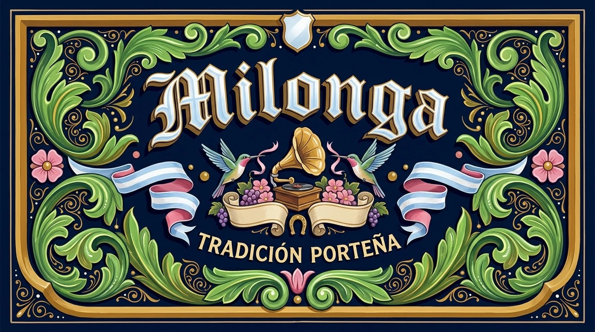

# Filete Porteño



Buenos Aires fileteado porteño translated into a modern poster and label system: a symmetrical, fully enclosed panel of glossy hand-painted enamel ornament on a dark contra-field, built from acanthus leaves ending in volutes, a thick modeled band, flat flowers, ribbons, dots and thin firulete lines, with gothic fish-tail lettering that has a projected body, cast shadow and white highlight strokes. It reads like a painted bus panel or shop-front sign, while subject, words and field color change completely each time.

## Copy Prompt

Default case: `tango-bandoneon`

```text
Use the "Filete Porteño" visual style as the locked style.

Create a 16:9 image.

Subject: An antique bandoneon with pearl buttons and bellows folds, shown front-on as a glossy painted emblem.
Action: floating on the central axis, held by two mirrored dragons whose tails turn into acanthus volutes
Prop / product: five-petal pink flowers, two light-blue ribbons with pink reverse sides, small ochre dots and a horseshoe above the instrument
Location: the glossy side panel of a vintage Buenos Aires bus
Background: dense green filigree spirals, teardrops and tiny white dots in all four corners
Main text: Tango
Secondary text: Milonga de los viernes
Accent symbol: a small ochre heart with white highlight on the central axis under the instrument
Styling: gold outline on the letters, pearl beads along the headline and visible bristle streaks in the enamel

Style direction:
Buenos Aires fileteado porteño translated into a modern poster and label system: a symmetrical,
fully enclosed panel of glossy hand-painted enamel ornament on a dark contra-field, built from
acanthus leaves ending in volutes, a thick modeled band, flat flowers, ribbons, dots and thin
firulete lines, with gothic fish-tail lettering that has a projected body, cast shadow and white
highlight strokes. It reads like a painted bus panel or shop-front sign, while subject, words
and field color change completely each time.

Keep visible:
- [CORE] The whole composition sits inside a clearly painted frame, with a deliberate margin (the talon) between frame and ornament, so it reads as a self-contained panel rather than a poster with free-floating decoration.
- [CORE] Near-obsessive symmetry: the left and right halves mirror each other around a central axis, or follow a strict asymmetric balance with the heavier mass on the left and the band completing the right.
- [CORE] The panel is filled evenly from top to bottom: headline, emblem and supporting line are spaced across the full height, and no empty field larger than about one seventh of the panel height is left; extra filigree, flowers, a cartouche or a second ribbon fill any remaining gap.
- [CORE] A thick banda with visible volume runs along the border and, together with acanthus leaves, structures the entire layout; a much thinner firulete line accompanies the band at an even distance.
- [CORE] Acanthus leaves that end in volutes are the main ornament; each leaf differs slightly in shape or direction, ribs are marked with a brighter tone, and smaller dense spirals (filigree) fill gaps.

Avoid:
photorealistic scene, 3D render, cinematic lighting, airbrush gradient, digital vector
illustration, sticker look, uniform line weight, perfect circles, smooth satin background, serif
font, sans-serif font, duplicated text,  neon glow, pastel palette, minimalist layout, flat
vector icon, halftone, paper grain, grunge texture, asymmetrical accidental layout, cropped
frame, floating ornament without frame, extra text, misspelled text, invented words, logo, brand
mark, literal national flag, watermark, QR code, poster mockup, photorealistic emblem, 3D
rendered object, stock photo object, large empty area inside the panel, modern geometric sans-
serif text

Do not copy source content, real logos, watermarks, platform UI, QR codes, or exact
reference layouts. Keep the visual system, but change the subject, text, and scene.
```

## Full Style

- [Open style.json](../../styles/filete-porteno/style.json)
- [Open style folder](../../styles/filete-porteno/)

<!-- Generated by scripts/generate-copy-prompts.py. Do not edit manually. -->
